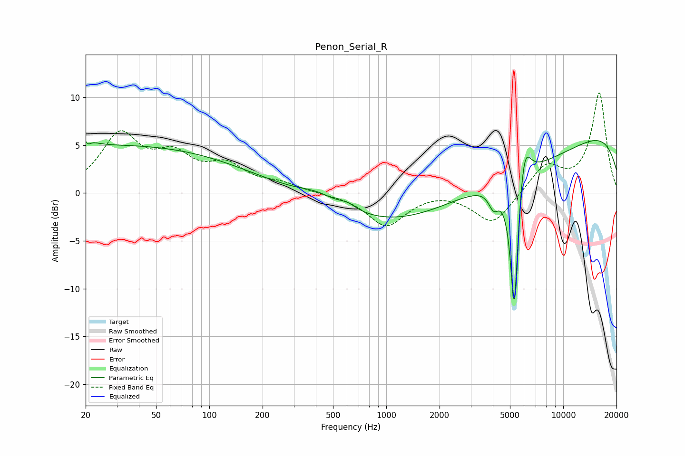

# Penon_Serial_R
See [usage instructions](https://github.com/jaakkopasanen/AutoEq#usage) for more options and info.

### Parametric EQs
Apply preamp of -5.6 dB when using parametric equalizer.

|   # | Type    |   Fc (Hz) |    Q |   Gain (dB) |
|-----|---------|-----------|------|-------------|
|   1 | Peaking |        20 | 4.62 |         4   |
|   2 | Peaking |        20 | 5.83 |        -3.4 |
|   3 | Peaking |        32 | 0.19 |         4.9 |
|   4 | Peaking |       407 | 1.39 |         0.9 |
|   5 | Peaking |       605 | 2.87 |         0.6 |
|   6 | Peaking |      3367 | 0.18 |        -6.5 |
|   7 | Peaking |      4045 | 4.84 |        -1.9 |
|   8 | Peaking |      5285 | 6    |       -15.4 |
|   9 | Peaking |      6017 | 3.99 |         4.8 |
|  10 | Peaking |      9104 | 0.18 |         9.1 |

### Fixed Band EQs
When using fixed band (also called graphic) equalizer, apply preamp of **-10.6 dB** (if available) and set gains manually with these parameters.

|   # | Type    |   Fc (Hz) |    Q |   Gain (dB) |
|-----|---------|-----------|------|-------------|
|   1 | Peaking |        31 | 1.41 |         5.8 |
|   2 | Peaking |        62 | 1.41 |         3.3 |
|   3 | Peaking |       125 | 1.41 |         2.5 |
|   4 | Peaking |       250 | 1.41 |         0.8 |
|   5 | Peaking |       500 | 1.41 |        -0.1 |
|   6 | Peaking |      1000 | 1.41 |        -3.4 |
|   7 | Peaking |      2000 | 1.41 |         0.3 |
|   8 | Peaking |      4000 | 1.41 |        -3.3 |
|   9 | Peaking |      8000 | 1.41 |         2.9 |
|  10 | Peaking |     16000 | 1.41 |        10.4 |

### Graphs

