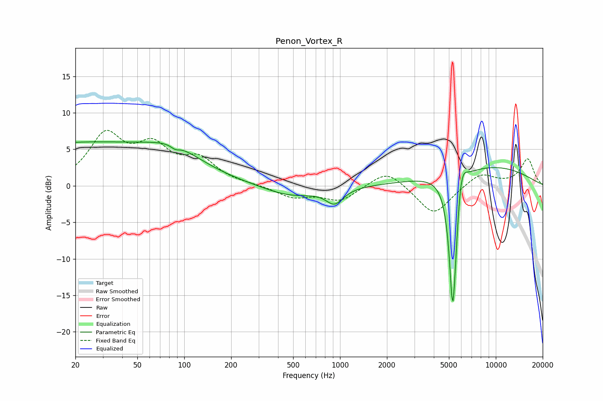

# Penon_Vortex_R
See [usage instructions](https://github.com/jaakkopasanen/AutoEq#usage) for more options and info.

### Parametric EQs
Apply preamp of -6.1 dB when using parametric equalizer.

|   # | Type    |   Fc (Hz) |    Q |   Gain (dB) |
|-----|---------|-----------|------|-------------|
|   1 | Peaking |        21 | 0.2  |         5.8 |
|   2 | Peaking |        87 | 0.86 |         2   |
|   3 | Peaking |        87 | 6    |         3   |
|   4 | Peaking |        87 | 5.83 |        -3.6 |
|   5 | Peaking |       480 | 0.82 |        -1.5 |
|   6 | Peaking |       923 | 2.57 |        -2.1 |
|   7 | Peaking |      5279 | 5.79 |       -16.3 |
|   8 | Peaking |      5440 | 6    |        -4.5 |
|   9 | Peaking |      5960 | 4.24 |         4.5 |
|  10 | Peaking |      8648 | 0.39 |         2.7 |

### Fixed Band EQs
When using fixed band (also called graphic) equalizer, apply preamp of **-7.7 dB** (if available) and set gains manually with these parameters.

|   # | Type    |   Fc (Hz) |    Q |   Gain (dB) |
|-----|---------|-----------|------|-------------|
|   1 | Peaking |        31 | 1.41 |         6.6 |
|   2 | Peaking |        62 | 1.41 |         4.6 |
|   3 | Peaking |       125 | 1.41 |         3.2 |
|   4 | Peaking |       250 | 1.41 |         0.1 |
|   5 | Peaking |       500 | 1.41 |        -1.5 |
|   6 | Peaking |      1000 | 1.41 |        -2   |
|   7 | Peaking |      2000 | 1.41 |         2.4 |
|   8 | Peaking |      4000 | 1.41 |        -4.1 |
|   9 | Peaking |      8000 | 1.41 |         1.8 |
|  10 | Peaking |     16000 | 1.41 |         3.7 |

### Graphs

