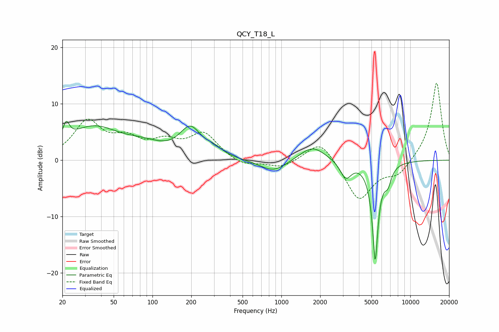

# QCY_T18_L
See [usage instructions](https://github.com/jaakkopasanen/AutoEq#usage) for more options and info.

### Parametric EQs
Apply preamp of -7.0 dB when using parametric equalizer.

|   # | Type    |   Fc (Hz) |    Q |   Gain (dB) |
|-----|---------|-----------|------|-------------|
|   1 | Peaking |        21 | 5.88 |         2.9 |
|   2 | Peaking |        35 | 0.66 |         5.7 |
|   3 | Peaking |        86 | 1.02 |         1.5 |
|   4 | Peaking |       196 | 1.7  |         5.1 |
|   5 | Peaking |       300 | 2.1  |         1.2 |
|   6 | Peaking |       864 | 1.37 |        -2.2 |
|   7 | Peaking |      1741 | 1.46 |         2.6 |
|   8 | Peaking |      3160 | 3.29 |        -3.1 |
|   9 | Peaking |      5345 | 6    |       -17.4 |
|  10 | Peaking |      6692 | 4.88 |        -2.7 |

### Fixed Band EQs
When using fixed band (also called graphic) equalizer, apply preamp of **-13.8 dB** (if available) and set gains manually with these parameters.

|   # | Type    |   Fc (Hz) |    Q |   Gain (dB) |
|-----|---------|-----------|------|-------------|
|   1 | Peaking |        31 | 1.41 |         6.6 |
|   2 | Peaking |        62 | 1.41 |         3.1 |
|   3 | Peaking |       125 | 1.41 |         2.7 |
|   4 | Peaking |       250 | 1.41 |         4.5 |
|   5 | Peaking |       500 | 1.41 |        -1.1 |
|   6 | Peaking |      1000 | 1.41 |        -1.4 |
|   7 | Peaking |      2000 | 1.41 |         3.9 |
|   8 | Peaking |      4000 | 1.41 |        -7.2 |
|   9 | Peaking |      8000 | 1.41 |        -2.5 |
|  10 | Peaking |     16000 | 1.41 |        14   |

### Graphs

