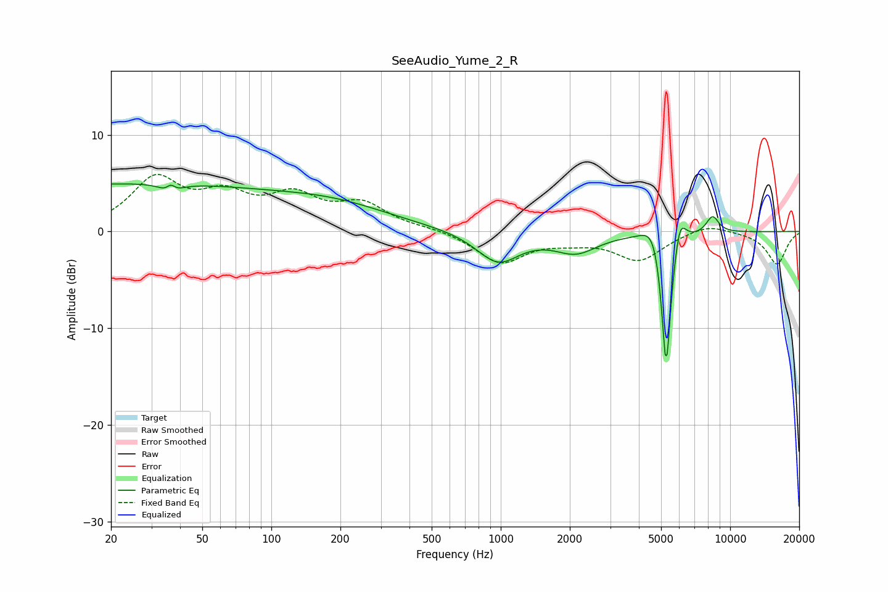

# SeeAudio_Yume_2_R
See [usage instructions](https://github.com/jaakkopasanen/AutoEq#usage) for more options and info.

### Parametric EQs
Apply preamp of -5.0 dB when using parametric equalizer.

|   # | Type    |   Fc (Hz) |    Q |   Gain (dB) |
|-----|---------|-----------|------|-------------|
|   1 | Peaking |        23 | 0.19 |         4.9 |
|   2 | Peaking |        36 | 4.74 |        -3.2 |
|   3 | Peaking |        36 | 6    |         3   |
|   4 | Peaking |       192 | 0.55 |         2   |
|   5 | Peaking |       973 | 1.51 |        -3.2 |
|   6 | Peaking |      2127 | 1.51 |        -2   |
|   7 | Peaking |      4679 | 3.06 |         3.1 |
|   8 | Peaking |      5261 | 6    |       -16.1 |
|   9 | Peaking |      6022 | 5.14 |         3.5 |
|  10 | Peaking |      8379 | 4.68 |         1.8 |

### Fixed Band EQs
When using fixed band (also called graphic) equalizer, apply preamp of **-6.0 dB** (if available) and set gains manually with these parameters.

|   # | Type    |   Fc (Hz) |    Q |   Gain (dB) |
|-----|---------|-----------|------|-------------|
|   1 | Peaking |        31 | 1.41 |         5.2 |
|   2 | Peaking |        62 | 1.41 |         3.1 |
|   3 | Peaking |       125 | 1.41 |         3.2 |
|   4 | Peaking |       250 | 1.41 |         2.6 |
|   5 | Peaking |       500 | 1.41 |         0.3 |
|   6 | Peaking |      1000 | 1.41 |        -3.2 |
|   7 | Peaking |      2000 | 1.41 |        -0.7 |
|   8 | Peaking |      4000 | 1.41 |        -2.9 |
|   9 | Peaking |      8000 | 1.41 |         0.9 |
|  10 | Peaking |     16000 | 1.41 |        -3.4 |

### Graphs

