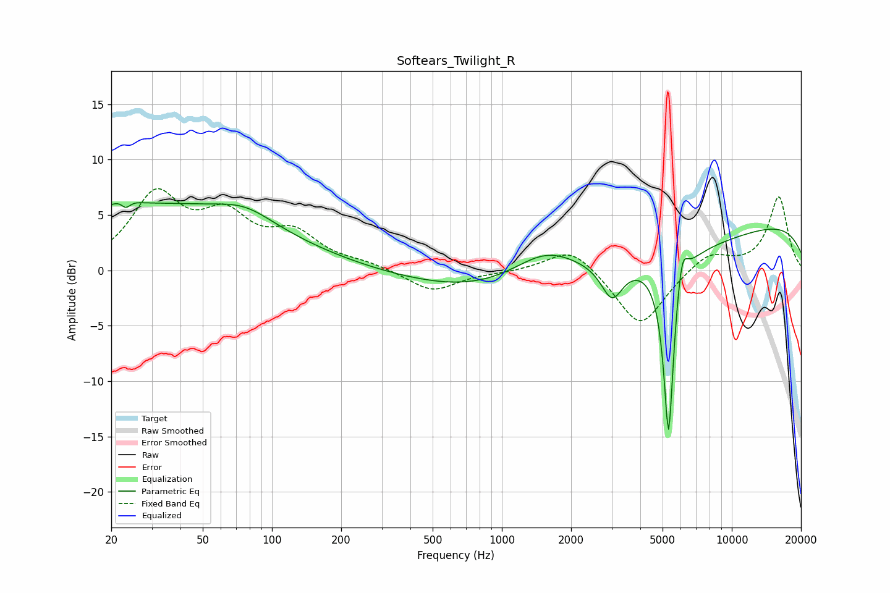

# Softears_Twilight_R
See [usage instructions](https://github.com/jaakkopasanen/AutoEq#usage) for more options and info.

### Parametric EQs
Apply preamp of -6.2 dB when using parametric equalizer.

|   # | Type    |   Fc (Hz) |    Q |   Gain (dB) |
|-----|---------|-----------|------|-------------|
|   1 | Peaking |        23 | 4.5  |         2.9 |
|   2 | Peaking |        23 | 5.52 |        -3   |
|   3 | Peaking |        29 | 0.24 |         5.8 |
|   4 | Peaking |        77 | 1.16 |         1.3 |
|   5 | Peaking |      1550 | 0.94 |         3   |
|   6 | Peaking |      2426 | 0.18 |        -3.3 |
|   7 | Peaking |      3014 | 3.03 |        -3.2 |
|   8 | Peaking |      5311 | 6    |       -16.9 |
|   9 | Peaking |      6065 | 5.89 |         3.3 |
|  10 | Peaking |      9940 | 0.18 |         4.9 |

### Fixed Band EQs
When using fixed band (also called graphic) equalizer, apply preamp of **-7.5 dB** (if available) and set gains manually with these parameters.

|   # | Type    |   Fc (Hz) |    Q |   Gain (dB) |
|-----|---------|-----------|------|-------------|
|   1 | Peaking |        31 | 1.41 |         6.5 |
|   2 | Peaking |        62 | 1.41 |         4.2 |
|   3 | Peaking |       125 | 1.41 |         2.9 |
|   4 | Peaking |       250 | 1.41 |         0.5 |
|   5 | Peaking |       500 | 1.41 |        -1.9 |
|   6 | Peaking |      1000 | 1.41 |        -0.1 |
|   7 | Peaking |      2000 | 1.41 |         2.3 |
|   8 | Peaking |      4000 | 1.41 |        -5.2 |
|   9 | Peaking |      8000 | 1.41 |         1.7 |
|  10 | Peaking |     16000 | 1.41 |         6.6 |

### Graphs

