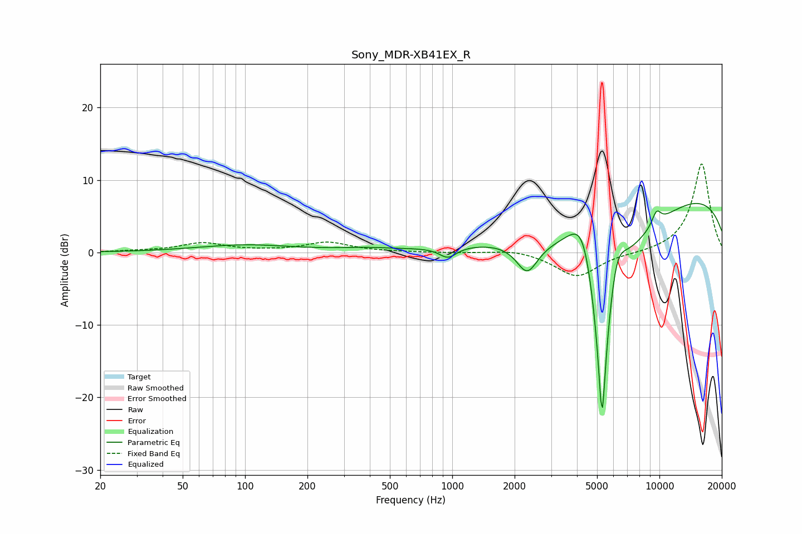

# Sony_MDR-XB41EX_R
See [usage instructions](https://github.com/jaakkopasanen/AutoEq#usage) for more options and info.

### Parametric EQs
Apply preamp of -6.9 dB when using parametric equalizer.

|   # | Type    |   Fc (Hz) |    Q |   Gain (dB) |
|-----|---------|-----------|------|-------------|
|   1 | Peaking |       100 | 0.6  |         1   |
|   2 | Peaking |       380 | 1.01 |         0.4 |
|   3 | Peaking |       953 | 3.42 |        -1.5 |
|   4 | Peaking |      2300 | 2.71 |        -4.3 |
|   5 | Peaking |      4307 | 1.74 |        10.7 |
|   6 | Peaking |      5285 | 6    |       -20   |
|   7 | Peaking |      5306 | 1.06 |       -20   |
|   8 | Peaking |      6178 | 2.9  |         6.8 |
|   9 | Peaking |      9680 | 5.49 |         1.9 |
|  10 | Peaking |      9682 | 0.18 |         9.2 |

### Fixed Band EQs
When using fixed band (also called graphic) equalizer, apply preamp of **-12.3 dB** (if available) and set gains manually with these parameters.

|   # | Type    |   Fc (Hz) |    Q |   Gain (dB) |
|-----|---------|-----------|------|-------------|
|   1 | Peaking |        31 | 1.41 |         0.2 |
|   2 | Peaking |        62 | 1.41 |         1.3 |
|   3 | Peaking |       125 | 1.41 |         0.1 |
|   4 | Peaking |       250 | 1.41 |         1.4 |
|   5 | Peaking |       500 | 1.41 |         0.1 |
|   6 | Peaking |      1000 | 1.41 |        -0   |
|   7 | Peaking |      2000 | 1.41 |         0.5 |
|   8 | Peaking |      4000 | 1.41 |        -3.4 |
|   9 | Peaking |      8000 | 1.41 |        -0.1 |
|  10 | Peaking |     16000 | 1.41 |        12.3 |

### Graphs

