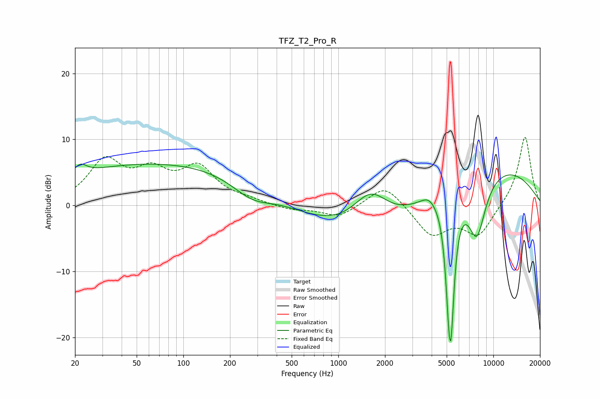

# TFZ_T2_Pro_R
See [usage instructions](https://github.com/jaakkopasanen/AutoEq#usage) for more options and info.

### Parametric EQs
Apply preamp of -6.4 dB when using parametric equalizer.

|   # | Type    |   Fc (Hz) |    Q |   Gain (dB) |
|-----|---------|-----------|------|-------------|
|   1 | Peaking |        22 | 3.62 |         1.5 |
|   2 | Peaking |        76 | 0.18 |         6.5 |
|   3 | Peaking |       276 | 1.05 |        -2.7 |
|   4 | Peaking |      1623 | 0.95 |         9.7 |
|   5 | Peaking |      1747 | 0.45 |       -11.3 |
|   6 | Peaking |      3816 | 3.02 |         1   |
|   7 | Peaking |      5185 | 6    |        -9.9 |
|   8 | Peaking |      5330 | 6    |       -14.1 |
|   9 | Peaking |      7265 | 0.27 |         7.7 |
|  10 | Peaking |      7820 | 2.15 |        -9.5 |

### Fixed Band EQs
When using fixed band (also called graphic) equalizer, apply preamp of **-10.4 dB** (if available) and set gains manually with these parameters.

|   # | Type    |   Fc (Hz) |    Q |   Gain (dB) |
|-----|---------|-----------|------|-------------|
|   1 | Peaking |        31 | 1.41 |         6.4 |
|   2 | Peaking |        62 | 1.41 |         4.2 |
|   3 | Peaking |       125 | 1.41 |         5.3 |
|   4 | Peaking |       250 | 1.41 |         0.6 |
|   5 | Peaking |       500 | 1.41 |        -0.7 |
|   6 | Peaking |      1000 | 1.41 |        -1.8 |
|   7 | Peaking |      2000 | 1.41 |         3.4 |
|   8 | Peaking |      4000 | 1.41 |        -4.5 |
|   9 | Peaking |      8000 | 1.41 |        -4.5 |
|  10 | Peaking |     16000 | 1.41 |        10.7 |

### Graphs

