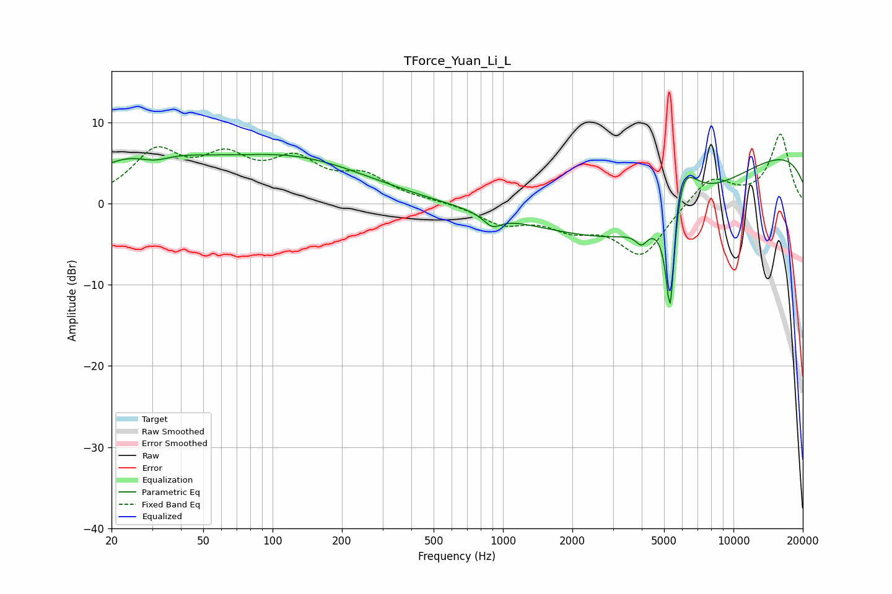

# TForce_Yuan_Li_L
See [usage instructions](https://github.com/jaakkopasanen/AutoEq#usage) for more options and info.

### Parametric EQs
Apply preamp of -6.1 dB when using parametric equalizer.

|   # | Type    |   Fc (Hz) |    Q |   Gain (dB) |
|-----|---------|-----------|------|-------------|
|   1 | Peaking |        27 | 0.64 |         5.2 |
|   2 | Peaking |        31 | 1.86 |        -1.5 |
|   3 | Peaking |       109 | 0.39 |         4.1 |
|   4 | Peaking |       143 | 0.54 |         1.3 |
|   5 | Peaking |       898 | 3.81 |        -1.5 |
|   6 | Peaking |      3997 | 5.63 |        -1.6 |
|   7 | Peaking |      4002 | 0.36 |       -10.2 |
|   8 | Peaking |      5317 | 6    |       -16.7 |
|   9 | Peaking |      5901 | 2.18 |         8.8 |
|  10 | Peaking |     10000 | 0.18 |         7.9 |

### Fixed Band EQs
When using fixed band (also called graphic) equalizer, apply preamp of **-8.6 dB** (if available) and set gains manually with these parameters.

|   # | Type    |   Fc (Hz) |    Q |   Gain (dB) |
|-----|---------|-----------|------|-------------|
|   1 | Peaking |        31 | 1.41 |         5.9 |
|   2 | Peaking |        62 | 1.41 |         4.6 |
|   3 | Peaking |       125 | 1.41 |         4.6 |
|   4 | Peaking |       250 | 1.41 |         3   |
|   5 | Peaking |       500 | 1.41 |         0.2 |
|   6 | Peaking |      1000 | 1.41 |        -2.3 |
|   7 | Peaking |      2000 | 1.41 |        -2.5 |
|   8 | Peaking |      4000 | 1.41 |        -6.3 |
|   9 | Peaking |      8000 | 1.41 |         3.4 |
|  10 | Peaking |     16000 | 1.41 |         8.5 |

### Graphs

