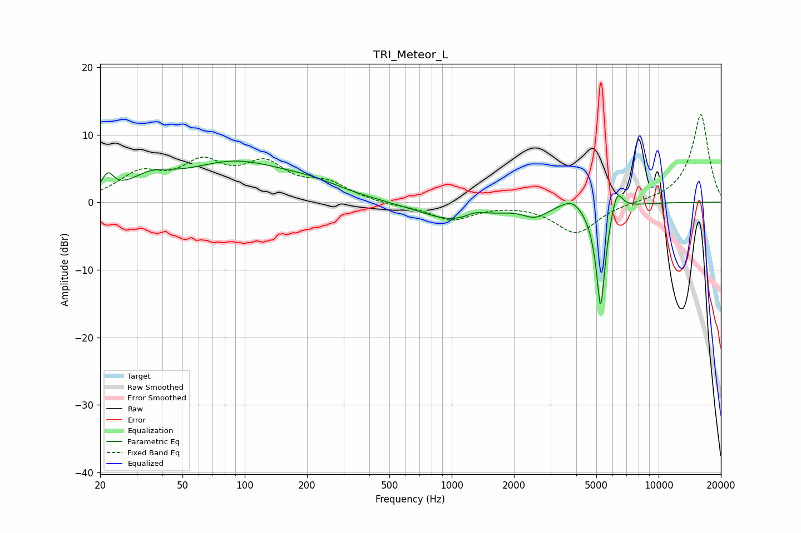

# TRI_Meteor_L
See [usage instructions](https://github.com/jaakkopasanen/AutoEq#usage) for more options and info.

### Parametric EQs
Apply preamp of -6.2 dB when using parametric equalizer.

|   # | Type    |   Fc (Hz) |    Q |   Gain (dB) |
|-----|---------|-----------|------|-------------|
|   1 | Peaking |        22 | 5.17 |         2.6 |
|   2 | Peaking |        35 | 1.43 |         2.3 |
|   3 | Peaking |        89 | 0.56 |         5.5 |
|   4 | Peaking |       212 | 0.89 |         1.4 |
|   5 | Peaking |      1037 | 0.85 |        -2.8 |
|   6 | Peaking |      1302 | 2.91 |         0.9 |
|   7 | Peaking |      2538 | 2.39 |        -1.6 |
|   8 | Peaking |      3824 | 2.72 |         1.5 |
|   9 | Peaking |      5249 | 6    |       -16.2 |
|  10 | Peaking |      6277 | 4.95 |         3.8 |

### Fixed Band EQs
When using fixed band (also called graphic) equalizer, apply preamp of **-13.1 dB** (if available) and set gains manually with these parameters.

|   # | Type    |   Fc (Hz) |    Q |   Gain (dB) |
|-----|---------|-----------|------|-------------|
|   1 | Peaking |        31 | 1.41 |         3.8 |
|   2 | Peaking |        62 | 1.41 |         5   |
|   3 | Peaking |       125 | 1.41 |         4.9 |
|   4 | Peaking |       250 | 1.41 |         2.4 |
|   5 | Peaking |       500 | 1.41 |        -0.4 |
|   6 | Peaking |      1000 | 1.41 |        -2.5 |
|   7 | Peaking |      2000 | 1.41 |        -0   |
|   8 | Peaking |      4000 | 1.41 |        -4.6 |
|   9 | Peaking |      8000 | 1.41 |        -0   |
|  10 | Peaking |     16000 | 1.41 |        13.1 |

### Graphs

