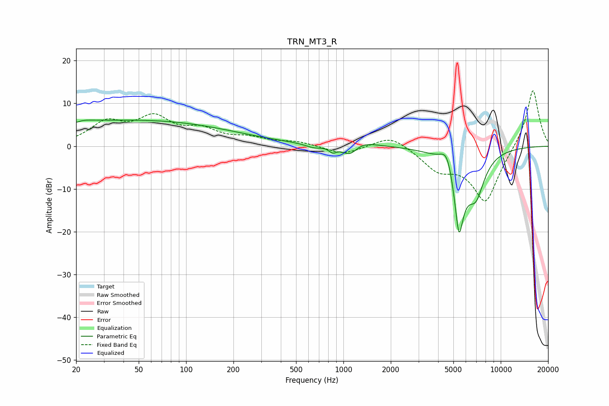

# TRN_MT3_R
See [usage instructions](https://github.com/jaakkopasanen/AutoEq#usage) for more options and info.

### Parametric EQs
Apply preamp of -6.2 dB when using parametric equalizer.

|   # | Type    |   Fc (Hz) |    Q |   Gain (dB) |
|-----|---------|-----------|------|-------------|
|   1 | Peaking |        20 | 1.4  |         1.3 |
|   2 | Peaking |        20 | 5.84 |        -0.4 |
|   3 | Peaking |        52 | 0.23 |         5.9 |
|   4 | Peaking |       653 | 2.46 |        -1   |
|   5 | Peaking |       856 | 5.44 |        -1.5 |
|   6 | Peaking |      1097 | 2.61 |        -4   |
|   7 | Peaking |      1167 | 1.47 |         2.5 |
|   8 | Peaking |      4574 | 3.25 |         5.9 |
|   9 | Peaking |      5425 | 3.53 |       -19.8 |
|  10 | Peaking |      6965 | 2.5  |        -8.4 |

### Fixed Band EQs
When using fixed band (also called graphic) equalizer, apply preamp of **-13.1 dB** (if available) and set gains manually with these parameters.

|   # | Type    |   Fc (Hz) |    Q |   Gain (dB) |
|-----|---------|-----------|------|-------------|
|   1 | Peaking |        31 | 1.41 |         5.1 |
|   2 | Peaking |        62 | 1.41 |         6   |
|   3 | Peaking |       125 | 1.41 |         3.2 |
|   4 | Peaking |       250 | 1.41 |         1.6 |
|   5 | Peaking |       500 | 1.41 |         1   |
|   6 | Peaking |      1000 | 1.41 |        -2   |
|   7 | Peaking |      2000 | 1.41 |         2.9 |
|   8 | Peaking |      4000 | 1.41 |        -4.6 |
|   9 | Peaking |      8000 | 1.41 |       -13.1 |
|  10 | Peaking |     16000 | 1.41 |        13.9 |

### Graphs

