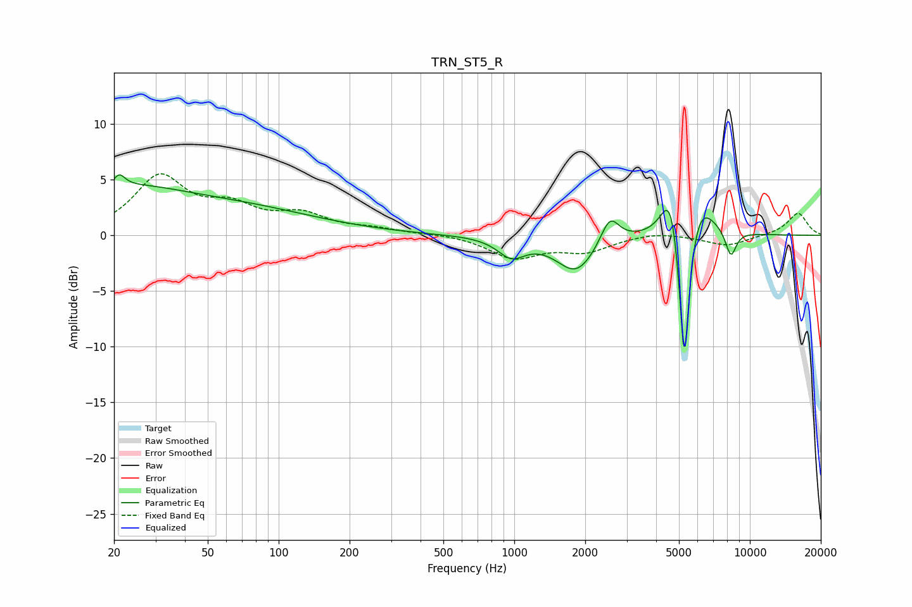

# TRN_ST5_R
See [usage instructions](https://github.com/jaakkopasanen/AutoEq#usage) for more options and info.

### Parametric EQs
Apply preamp of -5.5 dB when using parametric equalizer.

|   # | Type    |   Fc (Hz) |    Q |   Gain (dB) |
|-----|---------|-----------|------|-------------|
|   1 | Peaking |        21 | 5.69 |         1.2 |
|   2 | Peaking |        22 | 0.6  |         3.3 |
|   3 | Peaking |        65 | 0.41 |         2.2 |
|   4 | Peaking |       972 | 2.46 |        -1.7 |
|   5 | Peaking |      1830 | 1.71 |        -3.3 |
|   6 | Peaking |      2545 | 3.62 |         2.5 |
|   7 | Peaking |      4611 | 3.55 |         4.8 |
|   8 | Peaking |      5268 | 5.85 |       -15.5 |
|   9 | Peaking |      6006 | 2.12 |         4.2 |
|  10 | Peaking |      8304 | 5.62 |        -2.4 |

### Fixed Band EQs
When using fixed band (also called graphic) equalizer, apply preamp of **-5.6 dB** (if available) and set gains manually with these parameters.

|   # | Type    |   Fc (Hz) |    Q |   Gain (dB) |
|-----|---------|-----------|------|-------------|
|   1 | Peaking |        31 | 1.41 |         5.1 |
|   2 | Peaking |        62 | 1.41 |         2.1 |
|   3 | Peaking |       125 | 1.41 |         1.6 |
|   4 | Peaking |       250 | 1.41 |         0.5 |
|   5 | Peaking |       500 | 1.41 |         0.1 |
|   6 | Peaking |      1000 | 1.41 |        -2   |
|   7 | Peaking |      2000 | 1.41 |        -1.3 |
|   8 | Peaking |      4000 | 1.41 |         0.4 |
|   9 | Peaking |      8000 | 1.41 |        -0.9 |
|  10 | Peaking |     16000 | 1.41 |         2   |

### Graphs

