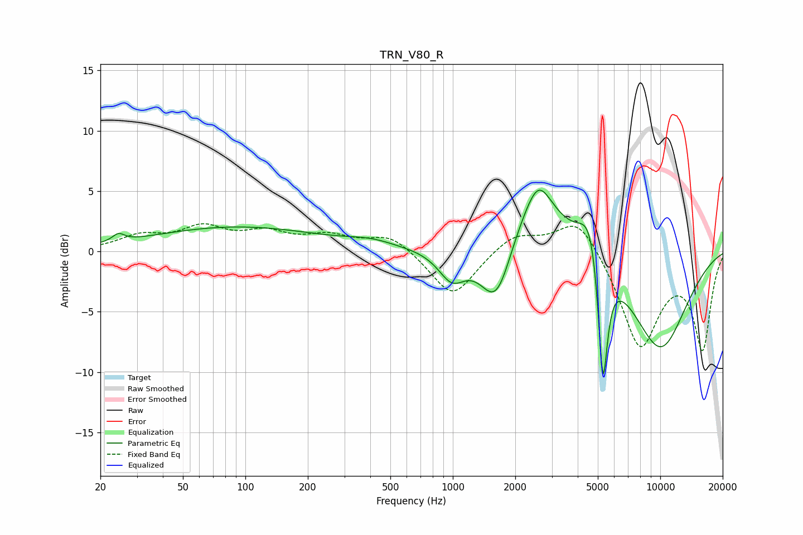

# TRN_V80_R
See [usage instructions](https://github.com/jaakkopasanen/AutoEq#usage) for more options and info.

### Parametric EQs
Apply preamp of -5.2 dB when using parametric equalizer.

|   # | Type    |   Fc (Hz) |    Q |   Gain (dB) |
|-----|---------|-----------|------|-------------|
|   1 | Peaking |        24 | 5.04 |         0.6 |
|   2 | Peaking |        91 | 0.34 |         2   |
|   3 | Peaking |       402 | 1.26 |         0.5 |
|   4 | Peaking |       991 | 2.14 |        -2.5 |
|   5 | Peaking |      1626 | 1.72 |        -6.3 |
|   6 | Peaking |      2368 | 0.89 |         5   |
|   7 | Peaking |      2594 | 2.51 |         2.3 |
|   8 | Peaking |      4633 | 2.53 |         4.2 |
|   9 | Peaking |      5290 | 5.91 |       -11.4 |
|  10 | Peaking |      9964 | 0.85 |        -8.1 |

### Fixed Band EQs
When using fixed band (also called graphic) equalizer, apply preamp of **-2.4 dB** (if available) and set gains manually with these parameters.

|   # | Type    |   Fc (Hz) |    Q |   Gain (dB) |
|-----|---------|-----------|------|-------------|
|   1 | Peaking |        31 | 1.41 |         1.1 |
|   2 | Peaking |        62 | 1.41 |         1.8 |
|   3 | Peaking |       125 | 1.41 |         1.3 |
|   4 | Peaking |       250 | 1.41 |         1.1 |
|   5 | Peaking |       500 | 1.41 |         1.4 |
|   6 | Peaking |      1000 | 1.41 |        -3.9 |
|   7 | Peaking |      2000 | 1.41 |         1.5 |
|   8 | Peaking |      4000 | 1.41 |         3.1 |
|   9 | Peaking |      8000 | 1.41 |        -7.9 |
|  10 | Peaking |     16000 | 1.41 |        -7.9 |

### Graphs

