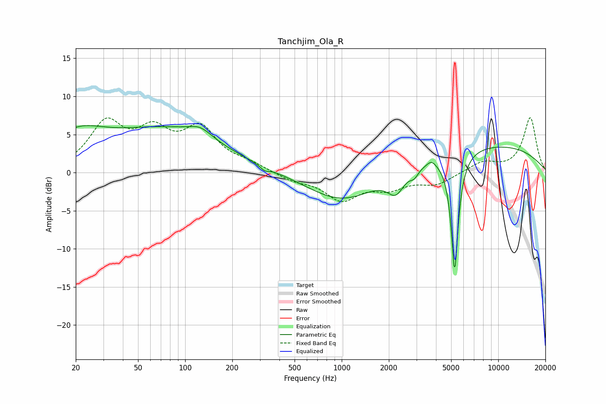

# Tanchjim_Ola_R
See [usage instructions](https://github.com/jaakkopasanen/AutoEq#usage) for more options and info.

### Parametric EQs
Apply preamp of -6.3 dB when using parametric equalizer.

|   # | Type    |   Fc (Hz) |    Q |   Gain (dB) |
|-----|---------|-----------|------|-------------|
|   1 | Peaking |        20 | 0.76 |         4.1 |
|   2 | Peaking |        76 | 0.39 |         5.3 |
|   3 | Peaking |       125 | 1.88 |         1.3 |
|   4 | Peaking |       322 | 5.19 |        -0.6 |
|   5 | Peaking |      1012 | 0.64 |        -3.9 |
|   6 | Peaking |      2217 | 2.65 |        -2.7 |
|   7 | Peaking |      2906 | 5.59 |        -0.9 |
|   8 | Peaking |      3738 | 5.32 |         0.7 |
|   9 | Peaking |      5264 | 6    |       -15.7 |
|  10 | Peaking |      8408 | 0.28 |         3.7 |

### Fixed Band EQs
When using fixed band (also called graphic) equalizer, apply preamp of **-7.3 dB** (if available) and set gains manually with these parameters.

|   # | Type    |   Fc (Hz) |    Q |   Gain (dB) |
|-----|---------|-----------|------|-------------|
|   1 | Peaking |        31 | 1.41 |         6.1 |
|   2 | Peaking |        62 | 1.41 |         4.5 |
|   3 | Peaking |       125 | 1.41 |         5.3 |
|   4 | Peaking |       250 | 1.41 |         0.9 |
|   5 | Peaking |       500 | 1.41 |        -1   |
|   6 | Peaking |      1000 | 1.41 |        -3.4 |
|   7 | Peaking |      2000 | 1.41 |        -1.8 |
|   8 | Peaking |      4000 | 1.41 |        -1.5 |
|   9 | Peaking |      8000 | 1.41 |         1.4 |
|  10 | Peaking |     16000 | 1.41 |         7.2 |

### Graphs

