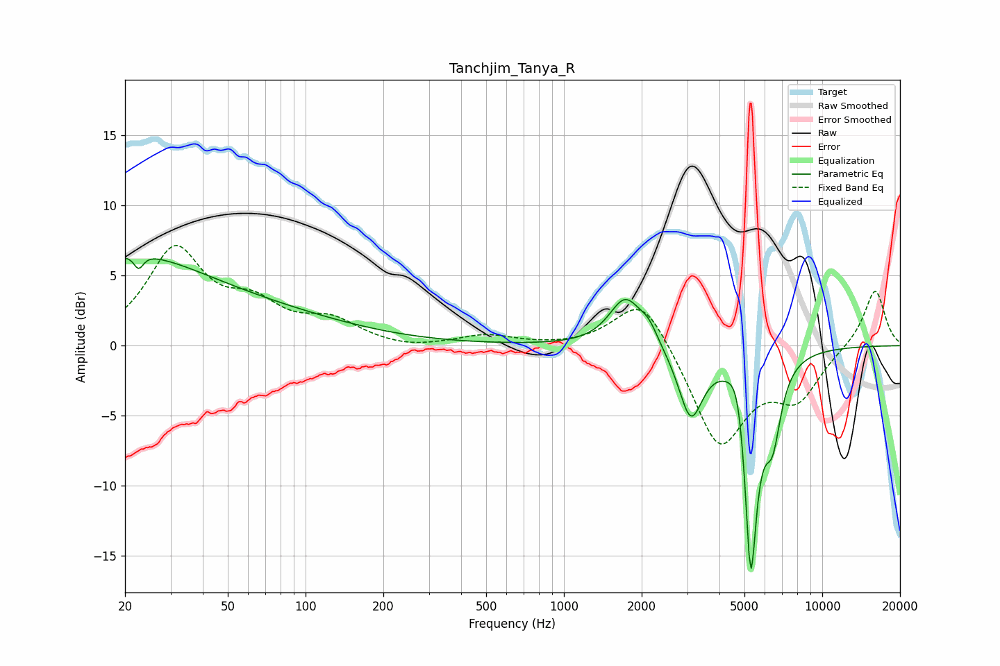

# Tanchjim_Tanya_R
See [usage instructions](https://github.com/jaakkopasanen/AutoEq#usage) for more options and info.

### Parametric EQs
Apply preamp of -6.3 dB when using parametric equalizer.

|   # | Type    |   Fc (Hz) |    Q |   Gain (dB) |
|-----|---------|-----------|------|-------------|
|   1 | Peaking |        20 | 0.49 |         5.5 |
|   2 | Peaking |        23 | 5.16 |         3.7 |
|   3 | Peaking |        23 | 5.83 |        -4.5 |
|   4 | Peaking |        64 | 0.39 |         1.8 |
|   5 | Peaking |      1728 | 2.28 |         3.4 |
|   6 | Peaking |      2129 | 3.91 |         1.1 |
|   7 | Peaking |      3097 | 3    |        -5   |
|   8 | Peaking |      4755 | 3.97 |         3.1 |
|   9 | Peaking |      5286 | 5.15 |       -16.3 |
|  10 | Peaking |      6425 | 4.2  |        -4.7 |

### Fixed Band EQs
When using fixed band (also called graphic) equalizer, apply preamp of **-7.2 dB** (if available) and set gains manually with these parameters.

|   # | Type    |   Fc (Hz) |    Q |   Gain (dB) |
|-----|---------|-----------|------|-------------|
|   1 | Peaking |        31 | 1.41 |         6.6 |
|   2 | Peaking |        62 | 1.41 |         2.4 |
|   3 | Peaking |       125 | 1.41 |         1.6 |
|   4 | Peaking |       250 | 1.41 |        -0.3 |
|   5 | Peaking |       500 | 1.41 |         0.7 |
|   6 | Peaking |      1000 | 1.41 |        -0.1 |
|   7 | Peaking |      2000 | 1.41 |         3.9 |
|   8 | Peaking |      4000 | 1.41 |        -7.2 |
|   9 | Peaking |      8000 | 1.41 |        -3.4 |
|  10 | Peaking |     16000 | 1.41 |         4.1 |

### Graphs

