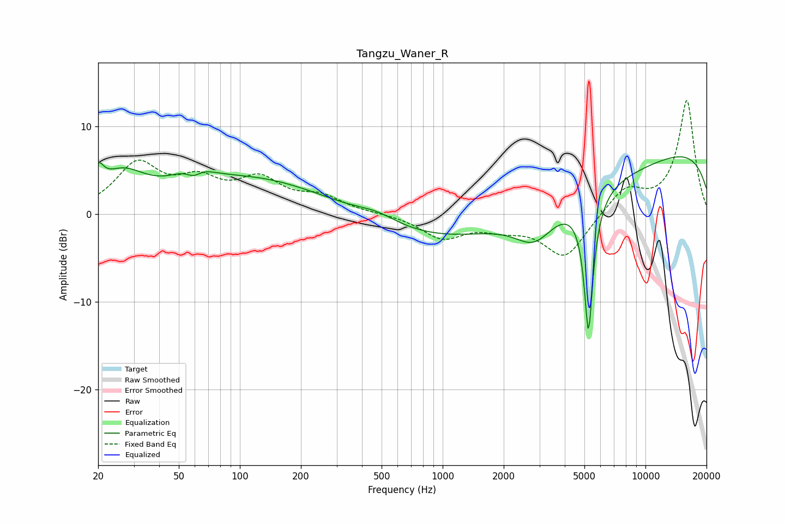

# Tangzu_Waner_R
See [usage instructions](https://github.com/jaakkopasanen/AutoEq#usage) for more options and info.

### Parametric EQs
Apply preamp of -6.6 dB when using parametric equalizer.

|   # | Type    |   Fc (Hz) |    Q |   Gain (dB) |
|-----|---------|-----------|------|-------------|
|   1 | Peaking |        20 | 5.44 |         2.5 |
|   2 | Peaking |        26 | 1.24 |         3.7 |
|   3 | Peaking |        59 | 2.16 |         3.6 |
|   4 | Peaking |        59 | 3.08 |        -2.9 |
|   5 | Peaking |       114 | 0.38 |         4.1 |
|   6 | Peaking |       473 | 1.38 |         1   |
|   7 | Peaking |      2656 | 0.18 |        -4.8 |
|   8 | Peaking |      2837 | 1.45 |        -3.6 |
|   9 | Peaking |      5238 | 6    |       -15.8 |
|  10 | Peaking |     10000 | 0.18 |         8.6 |

### Fixed Band EQs
When using fixed band (also called graphic) equalizer, apply preamp of **-13.0 dB** (if available) and set gains manually with these parameters.

|   # | Type    |   Fc (Hz) |    Q |   Gain (dB) |
|-----|---------|-----------|------|-------------|
|   1 | Peaking |        31 | 1.41 |         5.4 |
|   2 | Peaking |        62 | 1.41 |         3.1 |
|   3 | Peaking |       125 | 1.41 |         3.5 |
|   4 | Peaking |       250 | 1.41 |         1.7 |
|   5 | Peaking |       500 | 1.41 |         0.1 |
|   6 | Peaking |      1000 | 1.41 |        -2.6 |
|   7 | Peaking |      2000 | 1.41 |        -1.2 |
|   8 | Peaking |      4000 | 1.41 |        -4.9 |
|   9 | Peaking |      8000 | 1.41 |         2.9 |
|  10 | Peaking |     16000 | 1.41 |        13   |

### Graphs

