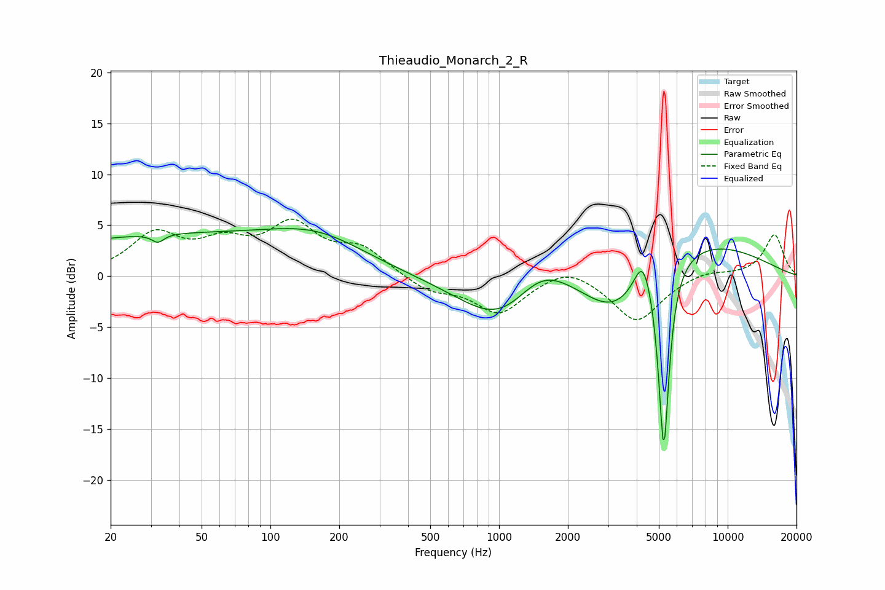

# Thieaudio_Monarch_2_R
See [usage instructions](https://github.com/jaakkopasanen/AutoEq#usage) for more options and info.

### Parametric EQs
Apply preamp of -4.8 dB when using parametric equalizer.

|   # | Type    |   Fc (Hz) |    Q |   Gain (dB) |
|-----|---------|-----------|------|-------------|
|   1 | Peaking |        32 | 5.53 |        -0.8 |
|   2 | Peaking |        35 | 0.23 |         3.9 |
|   3 | Peaking |       164 | 0.66 |         2.6 |
|   4 | Peaking |      1042 | 0.69 |        -7.2 |
|   5 | Peaking |      1507 | 1.18 |         2.9 |
|   6 | Peaking |      3188 | 0.65 |       -10.9 |
|   7 | Peaking |      3431 | 0.3  |         9.4 |
|   8 | Peaking |      4256 | 3.69 |         3.6 |
|   9 | Peaking |      5250 | 6    |        -4   |
|  10 | Peaking |      5256 | 6    |       -14.6 |

### Fixed Band EQs
When using fixed band (also called graphic) equalizer, apply preamp of **-5.7 dB** (if available) and set gains manually with these parameters.

|   # | Type    |   Fc (Hz) |    Q |   Gain (dB) |
|-----|---------|-----------|------|-------------|
|   1 | Peaking |        31 | 1.41 |         3.9 |
|   2 | Peaking |        62 | 1.41 |         2.7 |
|   3 | Peaking |       125 | 1.41 |         4.6 |
|   4 | Peaking |       250 | 1.41 |         2.5 |
|   5 | Peaking |       500 | 1.41 |        -1.4 |
|   6 | Peaking |      1000 | 1.41 |        -3.6 |
|   7 | Peaking |      2000 | 1.41 |         1.3 |
|   8 | Peaking |      4000 | 1.41 |        -4.5 |
|   9 | Peaking |      8000 | 1.41 |         0.6 |
|  10 | Peaking |     16000 | 1.41 |         4.1 |

### Graphs

