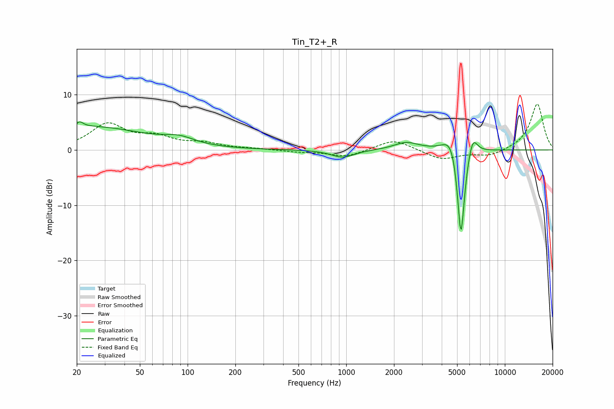

# Tin_T2+_R
See [usage instructions](https://github.com/jaakkopasanen/AutoEq#usage) for more options and info.

### Parametric EQs
Apply preamp of -5.2 dB when using parametric equalizer.

|   # | Type    |   Fc (Hz) |    Q |   Gain (dB) |
|-----|---------|-----------|------|-------------|
|   1 | Peaking |        20 | 6    |        -2.3 |
|   2 | Peaking |        21 | 5.95 |         3.2 |
|   3 | Peaking |        24 | 0.41 |         4.1 |
|   4 | Peaking |        88 | 1.5  |         1.2 |
|   5 | Peaking |       951 | 1.93 |        -1.4 |
|   6 | Peaking |      2393 | 1.86 |         1.4 |
|   7 | Peaking |      4604 | 2.8  |         3.6 |
|   8 | Peaking |      5281 | 6    |       -14.1 |
|   9 | Peaking |      5305 | 6    |        -3.5 |
|  10 | Peaking |      6267 | 4.73 |         3.5 |

### Fixed Band EQs
When using fixed band (also called graphic) equalizer, apply preamp of **-8.4 dB** (if available) and set gains manually with these parameters.

|   # | Type    |   Fc (Hz) |    Q |   Gain (dB) |
|-----|---------|-----------|------|-------------|
|   1 | Peaking |        31 | 1.41 |         4.5 |
|   2 | Peaking |        62 | 1.41 |         2   |
|   3 | Peaking |       125 | 1.41 |         1   |
|   4 | Peaking |       250 | 1.41 |         0.2 |
|   5 | Peaking |       500 | 1.41 |        -0.3 |
|   6 | Peaking |      1000 | 1.41 |        -1.3 |
|   7 | Peaking |      2000 | 1.41 |         2   |
|   8 | Peaking |      4000 | 1.41 |        -1.8 |
|   9 | Peaking |      8000 | 1.41 |        -1.1 |
|  10 | Peaking |     16000 | 1.41 |         8.4 |

### Graphs

