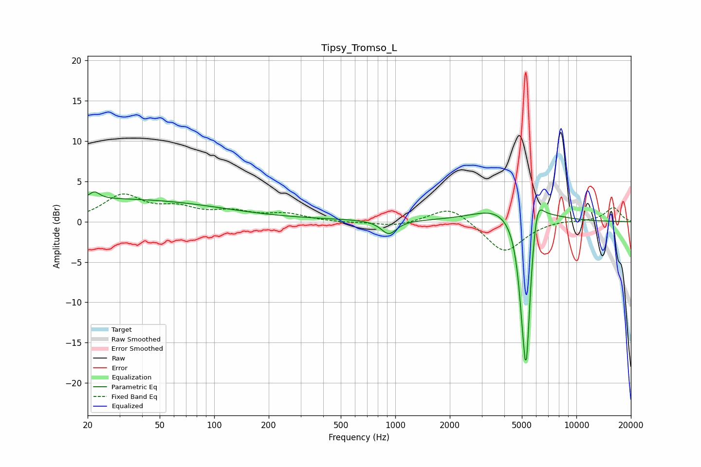

# Tipsy_Tromso_L
See [usage instructions](https://github.com/jaakkopasanen/AutoEq#usage) for more options and info.

### Parametric EQs
Apply preamp of -3.8 dB when using parametric equalizer.

|   # | Type    |   Fc (Hz) |    Q |   Gain (dB) |
|-----|---------|-----------|------|-------------|
|   1 | Peaking |        21 | 0.18 |         2.7 |
|   2 | Peaking |        22 | 5.75 |         2.9 |
|   3 | Peaking |        22 | 6    |        -2   |
|   4 | Peaking |       160 | 0.18 |         0.3 |
|   5 | Peaking |       921 | 3.37 |        -1.7 |
|   6 | Peaking |      3681 | 1.04 |         1.6 |
|   7 | Peaking |      5082 | 5.73 |        -5   |
|   8 | Peaking |      5293 | 5.52 |       -17.5 |
|   9 | Peaking |      6043 | 1.3  |         1.9 |
|  10 | Peaking |      6056 | 4.53 |         4.2 |

### Fixed Band EQs
When using fixed band (also called graphic) equalizer, apply preamp of **-3.5 dB** (if available) and set gains manually with these parameters.

|   # | Type    |   Fc (Hz) |    Q |   Gain (dB) |
|-----|---------|-----------|------|-------------|
|   1 | Peaking |        31 | 1.41 |         3.1 |
|   2 | Peaking |        62 | 1.41 |         1.4 |
|   3 | Peaking |       125 | 1.41 |         1.1 |
|   4 | Peaking |       250 | 1.41 |         0.9 |
|   5 | Peaking |       500 | 1.41 |        -0.1 |
|   6 | Peaking |      1000 | 1.41 |        -0.6 |
|   7 | Peaking |      2000 | 1.41 |         2   |
|   8 | Peaking |      4000 | 1.41 |        -3.9 |
|   9 | Peaking |      8000 | 1.41 |         0.2 |
|  10 | Peaking |     16000 | 1.41 |         1.8 |

### Graphs

