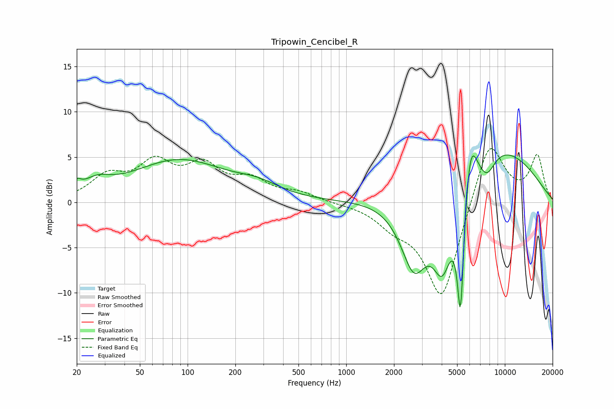

# Tripowin_Cencibel_R
See [usage instructions](https://github.com/jaakkopasanen/AutoEq#usage) for more options and info.

### Parametric EQs
Apply preamp of -5.3 dB when using parametric equalizer.

|   # | Type    |   Fc (Hz) |    Q |   Gain (dB) |
|-----|---------|-----------|------|-------------|
|   1 | Peaking |        20 | 5.57 |         0.9 |
|   2 | Peaking |        27 | 1.65 |         1.4 |
|   3 | Peaking |        88 | 0.47 |         4.6 |
|   4 | Peaking |       279 | 1.04 |         1.1 |
|   5 | Peaking |      2678 | 1.57 |        -8.5 |
|   6 | Peaking |      4043 | 2.07 |        -8.7 |
|   7 | Peaking |      5257 | 5.98 |       -14.5 |
|   8 | Peaking |      6051 | 3.36 |         5.8 |
|   9 | Peaking |      7715 | 1.25 |       -13.8 |
|  10 | Peaking |      7790 | 0.73 |        17.8 |

### Fixed Band EQs
When using fixed band (also called graphic) equalizer, apply preamp of **-6.0 dB** (if available) and set gains manually with these parameters.

|   # | Type    |   Fc (Hz) |    Q |   Gain (dB) |
|-----|---------|-----------|------|-------------|
|   1 | Peaking |        31 | 1.41 |         2.6 |
|   2 | Peaking |        62 | 1.41 |         3.9 |
|   3 | Peaking |       125 | 1.41 |         3.5 |
|   4 | Peaking |       250 | 1.41 |         2.1 |
|   5 | Peaking |       500 | 1.41 |         0.9 |
|   6 | Peaking |      1000 | 1.41 |        -0.1 |
|   7 | Peaking |      2000 | 1.41 |        -1.9 |
|   8 | Peaking |      4000 | 1.41 |       -10.9 |
|   9 | Peaking |      8000 | 1.41 |         7.4 |
|  10 | Peaking |     16000 | 1.41 |         5   |

### Graphs

