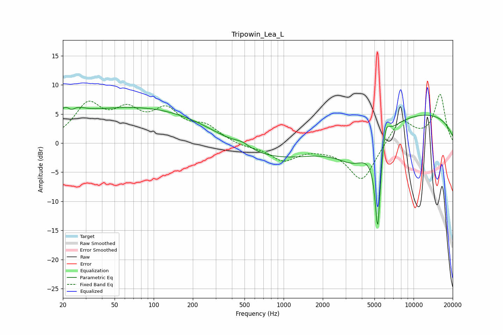

# Tripowin_Lea_L
See [usage instructions](https://github.com/jaakkopasanen/AutoEq#usage) for more options and info.

### Parametric EQs
Apply preamp of -6.2 dB when using parametric equalizer.

|   # | Type    |   Fc (Hz) |    Q |   Gain (dB) |
|-----|---------|-----------|------|-------------|
|   1 | Peaking |        23 | 2.38 |         5.2 |
|   2 | Peaking |        23 | 3.63 |        -3.6 |
|   3 | Peaking |        68 | 0.21 |         4.7 |
|   4 | Peaking |       109 | 0.25 |         1.6 |
|   5 | Peaking |       478 | 2.44 |         0.8 |
|   6 | Peaking |      1123 | 0.29 |        -4.3 |
|   7 | Peaking |      3565 | 0.95 |        -5.2 |
|   8 | Peaking |      5297 | 6    |       -16.7 |
|   9 | Peaking |      6065 | 4.54 |         4.3 |
|  10 | Peaking |      7981 | 0.18 |         5.7 |

### Fixed Band EQs
When using fixed band (also called graphic) equalizer, apply preamp of **-8.4 dB** (if available) and set gains manually with these parameters.

|   # | Type    |   Fc (Hz) |    Q |   Gain (dB) |
|-----|---------|-----------|------|-------------|
|   1 | Peaking |        31 | 1.41 |         6.1 |
|   2 | Peaking |        62 | 1.41 |         4.5 |
|   3 | Peaking |       125 | 1.41 |         4.9 |
|   4 | Peaking |       250 | 1.41 |         2.5 |
|   5 | Peaking |       500 | 1.41 |        -0.6 |
|   6 | Peaking |      1000 | 1.41 |        -2.8 |
|   7 | Peaking |      2000 | 1.41 |        -0.4 |
|   8 | Peaking |      4000 | 1.41 |        -6.6 |
|   9 | Peaking |      8000 | 1.41 |         4.2 |
|  10 | Peaking |     16000 | 1.41 |         8.3 |

### Graphs

