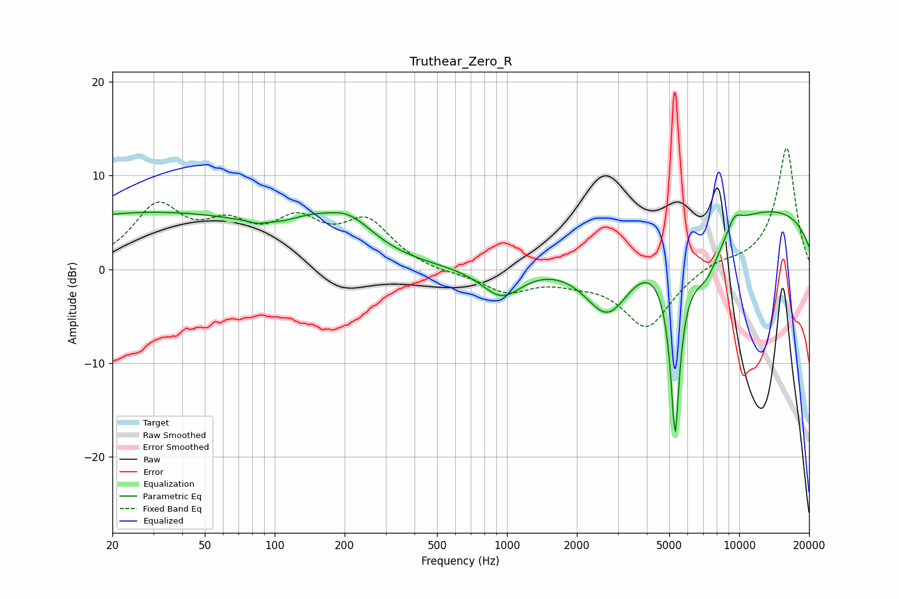

# Truthear_Zero_R
See [usage instructions](https://github.com/jaakkopasanen/AutoEq#usage) for more options and info.

### Parametric EQs
Apply preamp of -6.2 dB when using parametric equalizer.

|   # | Type    |   Fc (Hz) |    Q |   Gain (dB) |
|-----|---------|-----------|------|-------------|
|   1 | Peaking |        29 | 0.23 |         6   |
|   2 | Peaking |        84 | 4.22 |        -0.3 |
|   3 | Peaking |       140 | 1.7  |         1.1 |
|   4 | Peaking |       206 | 1.21 |         3.8 |
|   5 | Peaking |       951 | 1.59 |        -3.4 |
|   6 | Peaking |      2726 | 1.28 |        -8   |
|   7 | Peaking |      5299 | 5.98 |       -20   |
|   8 | Peaking |      7186 | 1.8  |        -5.3 |
|   9 | Peaking |      9547 | 4.16 |         1.4 |
|  10 | Peaking |      9995 | 0.18 |         6.9 |

### Fixed Band EQs
When using fixed band (also called graphic) equalizer, apply preamp of **-13.0 dB** (if available) and set gains manually with these parameters.

|   # | Type    |   Fc (Hz) |    Q |   Gain (dB) |
|-----|---------|-----------|------|-------------|
|   1 | Peaking |        31 | 1.41 |         6.3 |
|   2 | Peaking |        62 | 1.41 |         3.6 |
|   3 | Peaking |       125 | 1.41 |         4.3 |
|   4 | Peaking |       250 | 1.41 |         4.7 |
|   5 | Peaking |       500 | 1.41 |        -0.4 |
|   6 | Peaking |      1000 | 1.41 |        -2.3 |
|   7 | Peaking |      2000 | 1.41 |        -0.8 |
|   8 | Peaking |      4000 | 1.41 |        -6.2 |
|   9 | Peaking |      8000 | 1.41 |         0.8 |
|  10 | Peaking |     16000 | 1.41 |        13   |

### Graphs

