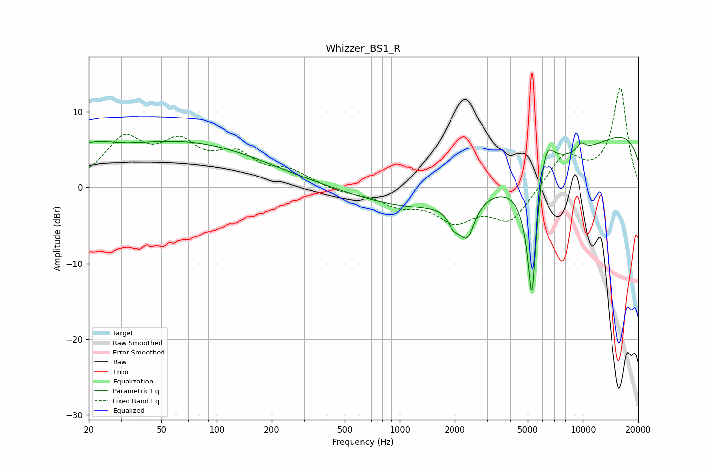

# Whizzer_BS1_R
See [usage instructions](https://github.com/jaakkopasanen/AutoEq#usage) for more options and info.

### Parametric EQs
Apply preamp of -6.7 dB when using parametric equalizer.

|   # | Type    |   Fc (Hz) |    Q |   Gain (dB) |
|-----|---------|-----------|------|-------------|
|   1 | Peaking |        20 | 1.26 |         2.8 |
|   2 | Peaking |        21 | 5    |        -0.1 |
|   3 | Peaking |        64 | 0.31 |         5.9 |
|   4 | Peaking |      1970 | 4.35 |        -2.1 |
|   5 | Peaking |      2329 | 3.46 |        -4.7 |
|   6 | Peaking |      4156 | 0.2  |        -7.4 |
|   7 | Peaking |      5267 | 4.63 |       -19.5 |
|   8 | Peaking |      6182 | 2.8  |         7   |
|   9 | Peaking |      9775 | 5.16 |         1.1 |
|  10 | Peaking |     10000 | 0.18 |        10.9 |

### Fixed Band EQs
When using fixed band (also called graphic) equalizer, apply preamp of **-13.2 dB** (if available) and set gains manually with these parameters.

|   # | Type    |   Fc (Hz) |    Q |   Gain (dB) |
|-----|---------|-----------|------|-------------|
|   1 | Peaking |        31 | 1.41 |         5.9 |
|   2 | Peaking |        62 | 1.41 |         4.9 |
|   3 | Peaking |       125 | 1.41 |         3.7 |
|   4 | Peaking |       250 | 1.41 |         1.9 |
|   5 | Peaking |       500 | 1.41 |        -0.7 |
|   6 | Peaking |      1000 | 1.41 |        -2   |
|   7 | Peaking |      2000 | 1.41 |        -3.9 |
|   8 | Peaking |      4000 | 1.41 |        -4.4 |
|   9 | Peaking |      8000 | 1.41 |         4.3 |
|  10 | Peaking |     16000 | 1.41 |        13   |

### Graphs

