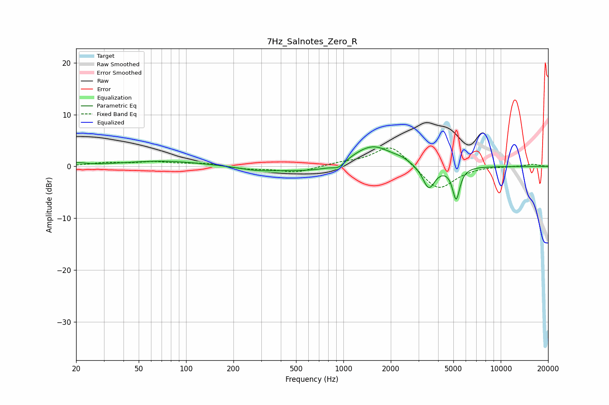

# 7Hz_Salnotes_Zero_R
See [usage instructions](https://github.com/jaakkopasanen/AutoEq#usage) for more options and info.

### Parametric EQs
Apply preamp of -3.9 dB when using parametric equalizer.

|   # | Type    |   Fc (Hz) |    Q |   Gain (dB) |
|-----|---------|-----------|------|-------------|
|   1 | Peaking |        20 | 2.72 |         0.5 |
|   2 | Peaking |        71 | 0.57 |         1   |
|   3 | Peaking |       281 | 1.28 |        -0.6 |
|   4 | Peaking |       764 | 0.57 |        -1.4 |
|   5 | Peaking |       935 | 3.92 |        -1   |
|   6 | Peaking |      1218 | 1.15 |         1.3 |
|   7 | Peaking |      1574 | 1.21 |         3.7 |
|   8 | Peaking |      2352 | 2.69 |         0.6 |
|   9 | Peaking |      3490 | 3.61 |        -4.5 |
|  10 | Peaking |      5207 | 6    |        -6.2 |

### Fixed Band EQs
When using fixed band (also called graphic) equalizer, apply preamp of **-3.7 dB** (if available) and set gains manually with these parameters.

|   # | Type    |   Fc (Hz) |    Q |   Gain (dB) |
|-----|---------|-----------|------|-------------|
|   1 | Peaking |        31 | 1.41 |         0.6 |
|   2 | Peaking |        62 | 1.41 |         0.8 |
|   3 | Peaking |       125 | 1.41 |         0.6 |
|   4 | Peaking |       250 | 1.41 |        -0.5 |
|   5 | Peaking |       500 | 1.41 |        -1.2 |
|   6 | Peaking |      1000 | 1.41 |         0.6 |
|   7 | Peaking |      2000 | 1.41 |         4.3 |
|   8 | Peaking |      4000 | 1.41 |        -4.8 |
|   9 | Peaking |      8000 | 1.41 |         0.1 |
|  10 | Peaking |     16000 | 1.41 |         0.4 |

### Graphs

