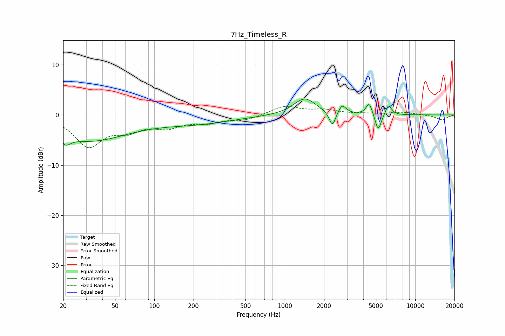

# 7Hz_Timeless_R
See [usage instructions](https://github.com/jaakkopasanen/AutoEq#usage) for more options and info.

### Parametric EQs
Apply preamp of -3.3 dB when using parametric equalizer.

|   # | Type    |   Fc (Hz) |    Q |   Gain (dB) |
|-----|---------|-----------|------|-------------|
|   1 | Peaking |        21 | 5.35 |        -4.8 |
|   2 | Peaking |        21 | 5.97 |         3.2 |
|   3 | Peaking |        31 | 0.46 |        -5   |
|   4 | Peaking |       210 | 0.49 |        -1.5 |
|   5 | Peaking |      1425 | 1.66 |         3.4 |
|   6 | Peaking |      2318 | 5.84 |        -3   |
|   7 | Peaking |      2755 | 4.97 |         1.8 |
|   8 | Peaking |      4438 | 6    |         2.5 |
|   9 | Peaking |      5204 | 5.97 |        -3.5 |
|  10 | Peaking |      6242 | 6    |         2.1 |

### Fixed Band EQs
When using fixed band (also called graphic) equalizer, apply preamp of **-1.8 dB** (if available) and set gains manually with these parameters.

|   # | Type    |   Fc (Hz) |    Q |   Gain (dB) |
|-----|---------|-----------|------|-------------|
|   1 | Peaking |        31 | 1.41 |        -6   |
|   2 | Peaking |        62 | 1.41 |        -2.5 |
|   3 | Peaking |       125 | 1.41 |        -2.1 |
|   4 | Peaking |       250 | 1.41 |        -1.3 |
|   5 | Peaking |       500 | 1.41 |        -0.9 |
|   6 | Peaking |      1000 | 1.41 |         1.8 |
|   7 | Peaking |      2000 | 1.41 |         0.9 |
|   8 | Peaking |      4000 | 1.41 |         0.2 |
|   9 | Peaking |      8000 | 1.41 |         0.5 |
|  10 | Peaking |     16000 | 1.41 |        -1   |

### Graphs

