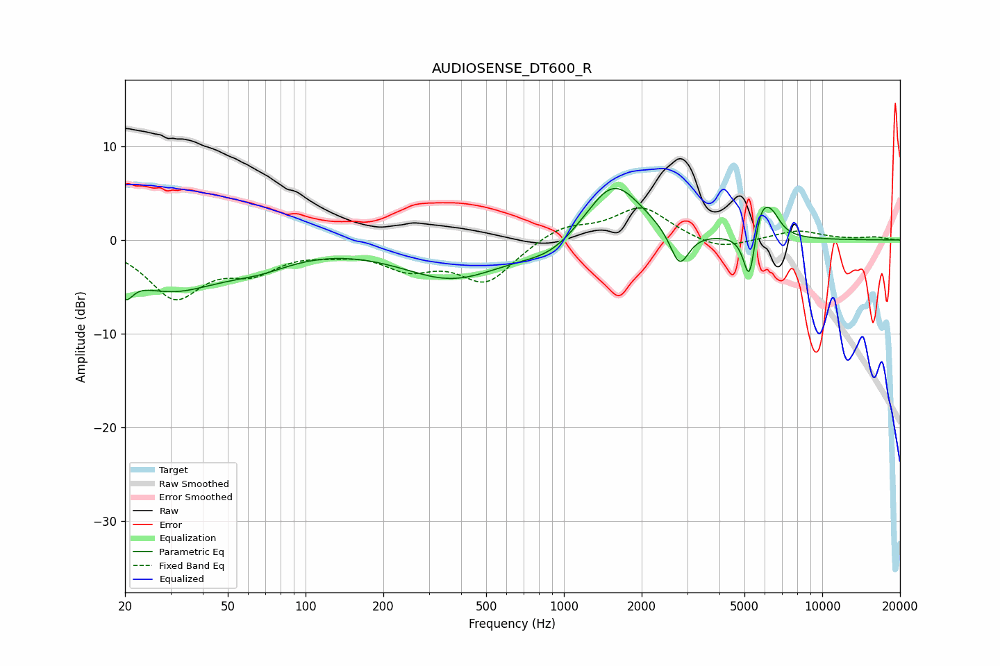

# AUDIOSENSE_DT600_R
See [usage instructions](https://github.com/jaakkopasanen/AutoEq#usage) for more options and info.

### Parametric EQs
Apply preamp of -5.6 dB when using parametric equalizer.

|   # | Type    |   Fc (Hz) |    Q |   Gain (dB) |
|-----|---------|-----------|------|-------------|
|   1 | Peaking |        20 | 4.91 |        -2.5 |
|   2 | Peaking |        30 | 0.7  |        -5   |
|   3 | Peaking |        66 | 1.05 |        -1.5 |
|   4 | Peaking |       370 | 0.71 |        -4   |
|   5 | Peaking |       898 | 1.24 |        -1.7 |
|   6 | Peaking |      1553 | 1.27 |         6.7 |
|   7 | Peaking |      2802 | 3.86 |        -3.9 |
|   8 | Peaking |      5229 | 6    |        -5.9 |
|   9 | Peaking |      5784 | 4.19 |         3.4 |
|  10 | Peaking |      6372 | 3.91 |         2   |

### Fixed Band EQs
When using fixed band (also called graphic) equalizer, apply preamp of **-3.5 dB** (if available) and set gains manually with these parameters.

|   # | Type    |   Fc (Hz) |    Q |   Gain (dB) |
|-----|---------|-----------|------|-------------|
|   1 | Peaking |        31 | 1.41 |        -5.8 |
|   2 | Peaking |        62 | 1.41 |        -2.7 |
|   3 | Peaking |       125 | 1.41 |        -0.8 |
|   4 | Peaking |       250 | 1.41 |        -2.6 |
|   5 | Peaking |       500 | 1.41 |        -4.3 |
|   6 | Peaking |      1000 | 1.41 |         1.6 |
|   7 | Peaking |      2000 | 1.41 |         3.5 |
|   8 | Peaking |      4000 | 1.41 |        -1.2 |
|   9 | Peaking |      8000 | 1.41 |         1   |
|  10 | Peaking |     16000 | 1.41 |         0.3 |

### Graphs

