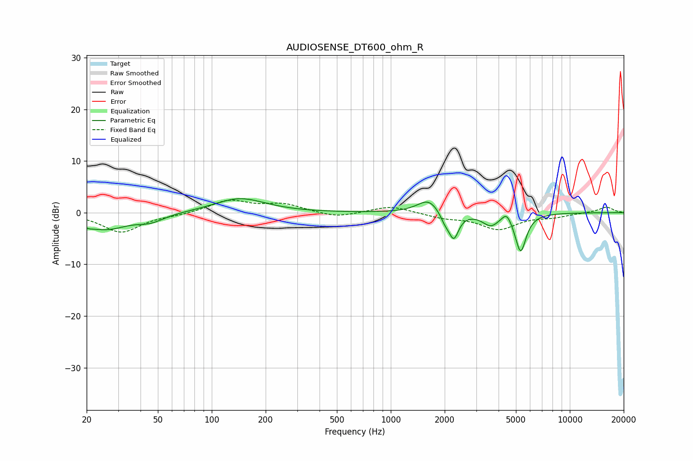

# AUDIOSENSE_DT600_ohm_R
See [usage instructions](https://github.com/jaakkopasanen/AutoEq#usage) for more options and info.

### Parametric EQs
Apply preamp of -2.8 dB when using parametric equalizer.

|   # | Type    |   Fc (Hz) |    Q |   Gain (dB) |
|-----|---------|-----------|------|-------------|
|   1 | Peaking |        20 | 4.76 |        -0.5 |
|   2 | Peaking |        25 | 1.12 |        -3.1 |
|   3 | Peaking |        46 | 1.92 |        -1.3 |
|   4 | Peaking |       143 | 0.99 |         2.8 |
|   5 | Peaking |      1627 | 2.32 |         2.7 |
|   6 | Peaking |      2012 | 5.07 |        -1.8 |
|   7 | Peaking |      2251 | 5.18 |        -4.8 |
|   8 | Peaking |      3613 | 3.07 |        -2.2 |
|   9 | Peaking |      4440 | 5.37 |         1.9 |
|  10 | Peaking |      5313 | 4.55 |        -7.5 |

### Fixed Band EQs
When using fixed band (also called graphic) equalizer, apply preamp of **-2.5 dB** (if available) and set gains manually with these parameters.

|   # | Type    |   Fc (Hz) |    Q |   Gain (dB) |
|-----|---------|-----------|------|-------------|
|   1 | Peaking |        31 | 1.41 |        -3.8 |
|   2 | Peaking |        62 | 1.41 |        -0.4 |
|   3 | Peaking |       125 | 1.41 |         2.3 |
|   4 | Peaking |       250 | 1.41 |         1.6 |
|   5 | Peaking |       500 | 1.41 |        -1   |
|   6 | Peaking |      1000 | 1.41 |         1.4 |
|   7 | Peaking |      2000 | 1.41 |        -0.9 |
|   8 | Peaking |      4000 | 1.41 |        -3.1 |
|   9 | Peaking |      8000 | 1.41 |        -0.7 |
|  10 | Peaking |     16000 | 1.41 |         1.1 |

### Graphs

