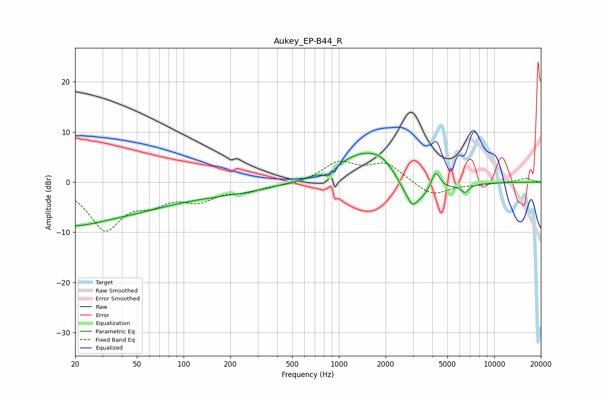

# Aukey_EP-B44_R
See [usage instructions](https://github.com/jaakkopasanen/AutoEq#usage) for more options and info.

### Parametric EQs
Apply preamp of -5.8 dB when using parametric equalizer.

|   # | Type    |   Fc (Hz) |    Q |   Gain (dB) |
|-----|---------|-----------|------|-------------|
|   1 | Peaking |        20 | 1.12 |        -1.3 |
|   2 | Peaking |        20 | 0.24 |        -7.3 |
|   3 | Peaking |       223 | 0.49 |        -1.6 |
|   4 | Peaking |       863 | 4.43 |        -1.5 |
|   5 | Peaking |      1422 | 0.79 |         5.8 |
|   6 | Peaking |      1983 | 1.45 |         3.2 |
|   7 | Peaking |      2961 | 5.32 |        -1.9 |
|   8 | Peaking |      2997 | 1.11 |        -6.3 |
|   9 | Peaking |      4190 | 4.66 |         4.1 |
|  10 | Peaking |      6486 | 5.18 |        -1.5 |

### Fixed Band EQs
When using fixed band (also called graphic) equalizer, apply preamp of **-4.3 dB** (if available) and set gains manually with these parameters.

|   # | Type    |   Fc (Hz) |    Q |   Gain (dB) |
|-----|---------|-----------|------|-------------|
|   1 | Peaking |        31 | 1.41 |        -9.1 |
|   2 | Peaking |        62 | 1.41 |        -3.1 |
|   3 | Peaking |       125 | 1.41 |        -3.1 |
|   4 | Peaking |       250 | 1.41 |        -1.5 |
|   5 | Peaking |       500 | 1.41 |        -0.6 |
|   6 | Peaking |      1000 | 1.41 |         3.8 |
|   7 | Peaking |      2000 | 1.41 |         3.6 |
|   8 | Peaking |      4000 | 1.41 |        -2.8 |
|   9 | Peaking |      8000 | 1.41 |        -0.4 |
|  10 | Peaking |     16000 | 1.41 |         0.8 |

### Graphs

