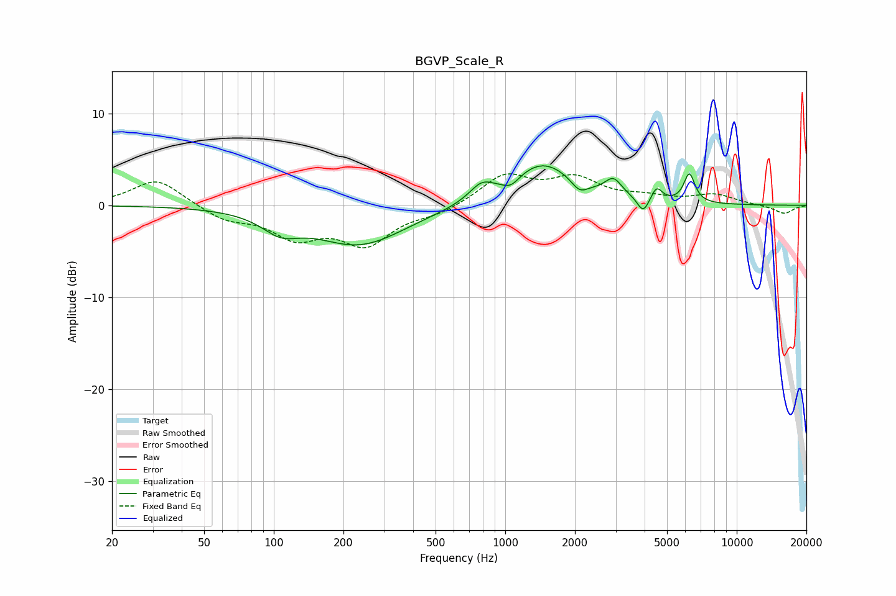

# BGVP_Scale_R
See [usage instructions](https://github.com/jaakkopasanen/AutoEq#usage) for more options and info.

### Parametric EQs
Apply preamp of -4.4 dB when using parametric equalizer.

|   # | Type    |   Fc (Hz) |    Q |   Gain (dB) |
|-----|---------|-----------|------|-------------|
|   1 | Peaking |       107 | 1.78 |        -1.9 |
|   2 | Peaking |       234 | 0.71 |        -4.3 |
|   3 | Peaking |       789 | 2.73 |         1.6 |
|   4 | Peaking |      1058 | 3.75 |        -1   |
|   5 | Peaking |      1446 | 0.99 |         4.6 |
|   6 | Peaking |      2091 | 3.81 |        -1.3 |
|   7 | Peaking |      2936 | 3.89 |         1.8 |
|   8 | Peaking |      3946 | 5.66 |        -1.7 |
|   9 | Peaking |      4509 | 6    |         1.5 |
|  10 | Peaking |      6243 | 5.86 |         3.2 |

### Fixed Band EQs
When using fixed band (also called graphic) equalizer, apply preamp of **-3.5 dB** (if available) and set gains manually with these parameters.

|   # | Type    |   Fc (Hz) |    Q |   Gain (dB) |
|-----|---------|-----------|------|-------------|
|   1 | Peaking |        31 | 1.41 |         2.9 |
|   2 | Peaking |        62 | 1.41 |        -1.5 |
|   3 | Peaking |       125 | 1.41 |        -3.2 |
|   4 | Peaking |       250 | 1.41 |        -4   |
|   5 | Peaking |       500 | 1.41 |        -0.8 |
|   6 | Peaking |      1000 | 1.41 |         3.2 |
|   7 | Peaking |      2000 | 1.41 |         2.7 |
|   8 | Peaking |      4000 | 1.41 |         0.7 |
|   9 | Peaking |      8000 | 1.41 |         1.1 |
|  10 | Peaking |     16000 | 1.41 |        -0.9 |

### Graphs

