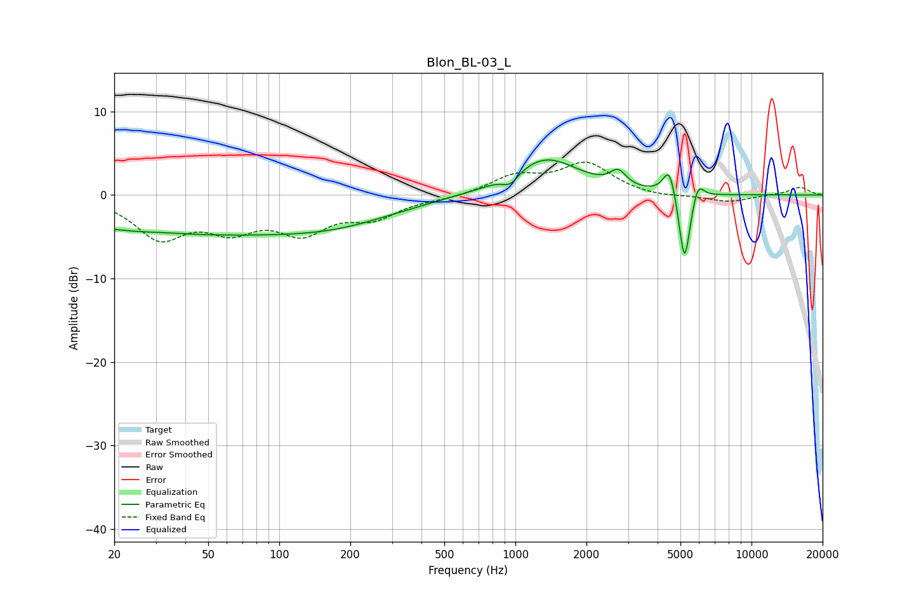

# Blon_BL-03_L
See [usage instructions](https://github.com/jaakkopasanen/AutoEq#usage) for more options and info.

### Parametric EQs
Apply preamp of -4.3 dB when using parametric equalizer.

|   # | Type    |   Fc (Hz) |    Q |   Gain (dB) |
|-----|---------|-----------|------|-------------|
|   1 | Peaking |        33 | 1.98 |         0.1 |
|   2 | Peaking |        36 | 0.24 |        -4.4 |
|   3 | Peaking |       184 | 0.53 |        -2.1 |
|   4 | Peaking |       953 | 4.12 |        -1.3 |
|   5 | Peaking |      1336 | 0.98 |         4.5 |
|   6 | Peaking |      2723 | 4.23 |         1.8 |
|   7 | Peaking |      4490 | 5.34 |         3.6 |
|   8 | Peaking |      5199 | 6    |        -7.4 |
|   9 | Peaking |      5229 | 6    |        -1.4 |
|  10 | Peaking |      5931 | 5.81 |         2.2 |

### Fixed Band EQs
When using fixed band (also called graphic) equalizer, apply preamp of **-4.0 dB** (if available) and set gains manually with these parameters.

|   # | Type    |   Fc (Hz) |    Q |   Gain (dB) |
|-----|---------|-----------|------|-------------|
|   1 | Peaking |        31 | 1.41 |        -4.8 |
|   2 | Peaking |        62 | 1.41 |        -3.4 |
|   3 | Peaking |       125 | 1.41 |        -3.9 |
|   4 | Peaking |       250 | 1.41 |        -2.4 |
|   5 | Peaking |       500 | 1.41 |        -0.4 |
|   6 | Peaking |      1000 | 1.41 |         2.1 |
|   7 | Peaking |      2000 | 1.41 |         3.7 |
|   8 | Peaking |      4000 | 1.41 |        -0.3 |
|   9 | Peaking |      8000 | 1.41 |        -0.8 |
|  10 | Peaking |     16000 | 1.41 |         1   |

### Graphs

