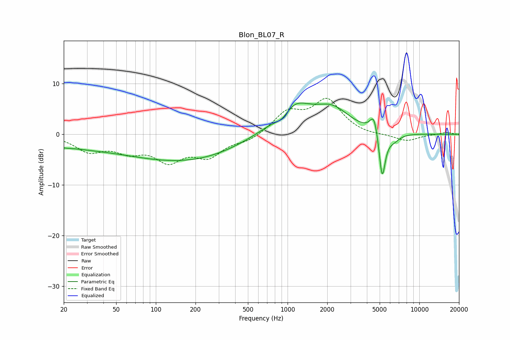

# Blon_BL07_R
See [usage instructions](https://github.com/jaakkopasanen/AutoEq#usage) for more options and info.

### Parametric EQs
Apply preamp of -6.3 dB when using parametric equalizer.

|   # | Type    |   Fc (Hz) |    Q |   Gain (dB) |
|-----|---------|-----------|------|-------------|
|   1 | Peaking |        20 | 2.82 |        -0.3 |
|   2 | Peaking |        25 | 0.5  |        -1.7 |
|   3 | Peaking |       141 | 0.35 |        -4.7 |
|   4 | Peaking |       289 | 0.62 |        -0.7 |
|   5 | Peaking |       922 | 2.24 |        -2.5 |
|   6 | Peaking |      1074 | 1.05 |         6.6 |
|   7 | Peaking |      2191 | 1.08 |         4.3 |
|   8 | Peaking |      4536 | 4.63 |         4.1 |
|   9 | Peaking |      5223 | 5.68 |        -9.7 |
|  10 | Peaking |      6386 | 2.85 |        -1.3 |

### Fixed Band EQs
When using fixed band (also called graphic) equalizer, apply preamp of **-7.2 dB** (if available) and set gains manually with these parameters.

|   # | Type    |   Fc (Hz) |    Q |   Gain (dB) |
|-----|---------|-----------|------|-------------|
|   1 | Peaking |        31 | 1.41 |        -3.1 |
|   2 | Peaking |        62 | 1.41 |        -2.7 |
|   3 | Peaking |       125 | 1.41 |        -4.6 |
|   4 | Peaking |       250 | 1.41 |        -3.9 |
|   5 | Peaking |       500 | 1.41 |        -1.2 |
|   6 | Peaking |      1000 | 1.41 |         4.1 |
|   7 | Peaking |      2000 | 1.41 |         6.5 |
|   8 | Peaking |      4000 | 1.41 |        -0.3 |
|   9 | Peaking |      8000 | 1.41 |        -1.4 |
|  10 | Peaking |     16000 | 1.41 |         0.4 |

### Graphs

