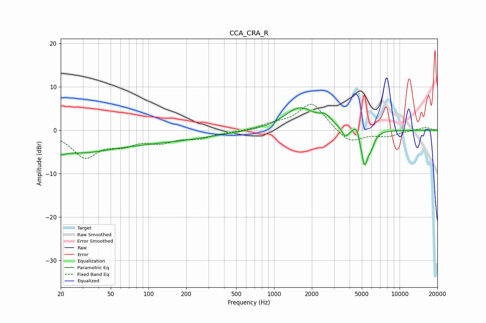

# CCA_CRA_R
See [usage instructions](https://github.com/jaakkopasanen/AutoEq#usage) for more options and info.

### Parametric EQs
Apply preamp of -5.3 dB when using parametric equalizer.

|   # | Type    |   Fc (Hz) |    Q |   Gain (dB) |
|-----|---------|-----------|------|-------------|
|   1 | Peaking |        20 | 5.68 |         3.4 |
|   2 | Peaking |        20 | 5.65 |        -4.1 |
|   3 | Peaking |        25 | 0.43 |        -4.8 |
|   4 | Peaking |       139 | 0.38 |        -2.1 |
|   5 | Peaking |      1600 | 1.17 |         5.1 |
|   6 | Peaking |      2565 | 2.97 |         1.9 |
|   7 | Peaking |      3690 | 5.39 |        -2.1 |
|   8 | Peaking |      4535 | 5.82 |         2.3 |
|   9 | Peaking |      5252 | 4.9  |        -8.1 |
|  10 | Peaking |      5959 | 5.58 |        -2.3 |

### Fixed Band EQs
When using fixed band (also called graphic) equalizer, apply preamp of **-6.1 dB** (if available) and set gains manually with these parameters.

|   # | Type    |   Fc (Hz) |    Q |   Gain (dB) |
|-----|---------|-----------|------|-------------|
|   1 | Peaking |        31 | 1.41 |        -5.9 |
|   2 | Peaking |        62 | 1.41 |        -2.6 |
|   3 | Peaking |       125 | 1.41 |        -2.3 |
|   4 | Peaking |       250 | 1.41 |        -1.6 |
|   5 | Peaking |       500 | 1.41 |        -0.3 |
|   6 | Peaking |      1000 | 1.41 |         1.1 |
|   7 | Peaking |      2000 | 1.41 |         6.4 |
|   8 | Peaking |      4000 | 1.41 |        -3.1 |
|   9 | Peaking |      8000 | 1.41 |        -1.3 |
|  10 | Peaking |     16000 | 1.41 |         0.7 |

### Graphs

