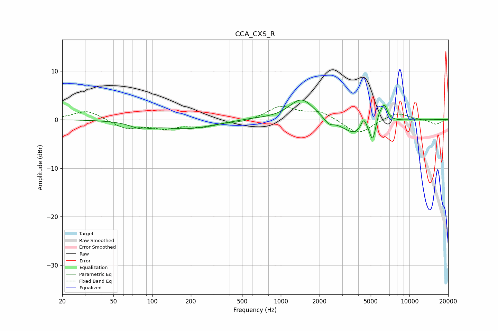

# CCA_CXS_R
See [usage instructions](https://github.com/jaakkopasanen/AutoEq#usage) for more options and info.

### Parametric EQs
Apply preamp of -4.1 dB when using parametric equalizer.

|   # | Type    |   Fc (Hz) |    Q |   Gain (dB) |
|-----|---------|-----------|------|-------------|
|   1 | Peaking |        82 | 1.71 |        -1.2 |
|   2 | Peaking |       186 | 0.7  |        -1.8 |
|   3 | Peaking |       596 | 1.58 |         0.2 |
|   4 | Peaking |      1450 | 1.48 |         4.4 |
|   5 | Peaking |      2364 | 3.78 |        -1.3 |
|   6 | Peaking |      3726 | 1.52 |        -3.1 |
|   7 | Peaking |      4412 | 5.99 |         2.4 |
|   8 | Peaking |      5178 | 6    |        -4   |
|   9 | Peaking |      5797 | 6    |         1.6 |
|  10 | Peaking |      6372 | 5.53 |         3.3 |

### Fixed Band EQs
When using fixed band (also called graphic) equalizer, apply preamp of **-2.8 dB** (if available) and set gains manually with these parameters.

|   # | Type    |   Fc (Hz) |    Q |   Gain (dB) |
|-----|---------|-----------|------|-------------|
|   1 | Peaking |        31 | 1.41 |         2   |
|   2 | Peaking |        62 | 1.41 |        -1.8 |
|   3 | Peaking |       125 | 1.41 |        -1.5 |
|   4 | Peaking |       250 | 1.41 |        -1.3 |
|   5 | Peaking |       500 | 1.41 |        -0.5 |
|   6 | Peaking |      1000 | 1.41 |         2.7 |
|   7 | Peaking |      2000 | 1.41 |         1.6 |
|   8 | Peaking |      4000 | 1.41 |        -3.1 |
|   9 | Peaking |      8000 | 1.41 |         1.5 |
|  10 | Peaking |     16000 | 1.41 |        -1   |

### Graphs

