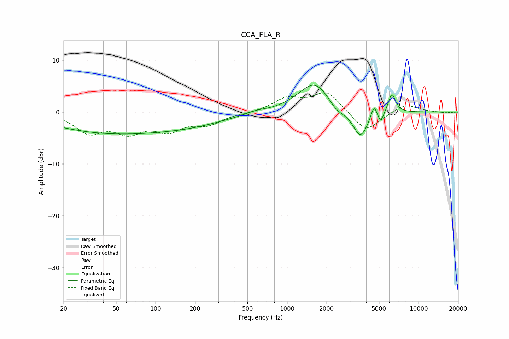

# CCA_FLA_R
See [usage instructions](https://github.com/jaakkopasanen/AutoEq#usage) for more options and info.

### Parametric EQs
Apply preamp of -5.3 dB when using parametric equalizer.

|   # | Type    |   Fc (Hz) |    Q |   Gain (dB) |
|-----|---------|-----------|------|-------------|
|   1 | Peaking |        46 | 0.31 |        -3.9 |
|   2 | Peaking |        51 | 2.01 |         0   |
|   3 | Peaking |       203 | 0.53 |        -1.5 |
|   4 | Peaking |       584 | 2.01 |         0.4 |
|   5 | Peaking |      1636 | 1.12 |         6   |
|   6 | Peaking |      2376 | 2.15 |        -1.9 |
|   7 | Peaking |      3618 | 2.39 |        -5.4 |
|   8 | Peaking |      4589 | 5.99 |         2.7 |
|   9 | Peaking |      5153 | 6    |        -2.1 |
|  10 | Peaking |      6269 | 4.94 |         3.8 |

### Fixed Band EQs
When using fixed band (also called graphic) equalizer, apply preamp of **-3.8 dB** (if available) and set gains manually with these parameters.

|   # | Type    |   Fc (Hz) |    Q |   Gain (dB) |
|-----|---------|-----------|------|-------------|
|   1 | Peaking |        31 | 1.41 |        -3.7 |
|   2 | Peaking |        62 | 1.41 |        -3.4 |
|   3 | Peaking |       125 | 1.41 |        -3.1 |
|   4 | Peaking |       250 | 1.41 |        -2.1 |
|   5 | Peaking |       500 | 1.41 |        -0.2 |
|   6 | Peaking |      1000 | 1.41 |         2.5 |
|   7 | Peaking |      2000 | 1.41 |         3.9 |
|   8 | Peaking |      4000 | 1.41 |        -4   |
|   9 | Peaking |      8000 | 1.41 |         1.6 |
|  10 | Peaking |     16000 | 1.41 |        -0.2 |

### Graphs

