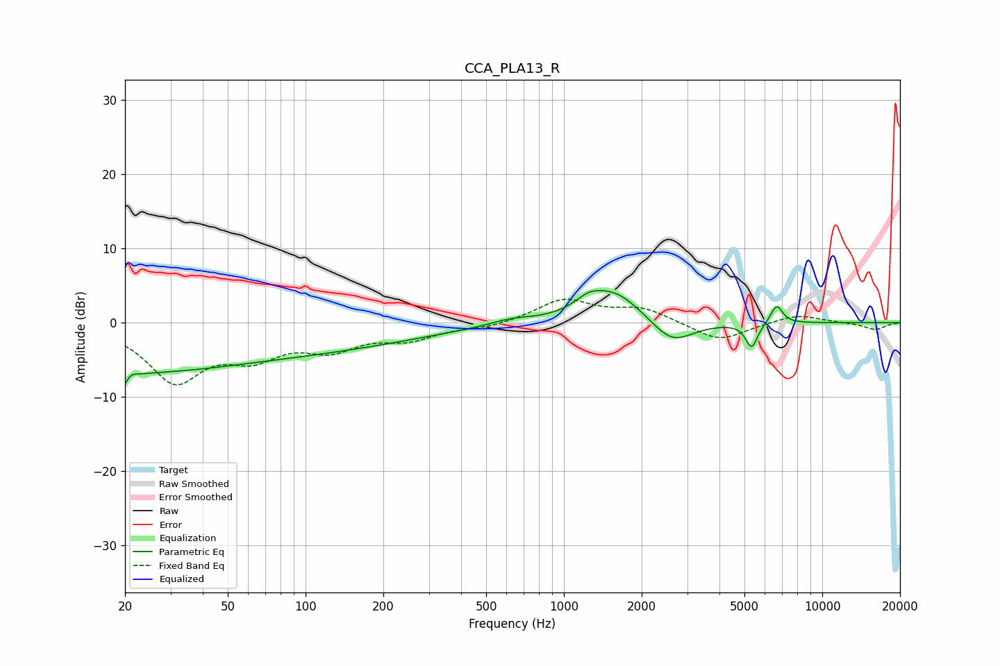

# CCA_PLA13_R
See [usage instructions](https://github.com/jaakkopasanen/AutoEq#usage) for more options and info.

### Parametric EQs
Apply preamp of -4.4 dB when using parametric equalizer.

|   # | Type    |   Fc (Hz) |    Q |   Gain (dB) |
|-----|---------|-----------|------|-------------|
|   1 | Peaking |        20 | 5.01 |        -4.9 |
|   2 | Peaking |        21 | 5.68 |         3.4 |
|   3 | Peaking |        21 | 0.33 |        -6.1 |
|   4 | Peaking |       129 | 0.39 |        -2.7 |
|   5 | Peaking |       624 | 1.66 |         0.7 |
|   6 | Peaking |      1248 | 2.61 |         1.4 |
|   7 | Peaking |      1569 | 1.29 |         4.2 |
|   8 | Peaking |      2622 | 1.72 |        -3.4 |
|   9 | Peaking |      5331 | 6    |        -3.3 |
|  10 | Peaking |      6659 | 5.84 |         2.5 |

### Fixed Band EQs
When using fixed band (also called graphic) equalizer, apply preamp of **-3.2 dB** (if available) and set gains manually with these parameters.

|   # | Type    |   Fc (Hz) |    Q |   Gain (dB) |
|-----|---------|-----------|------|-------------|
|   1 | Peaking |        31 | 1.41 |        -7.6 |
|   2 | Peaking |        62 | 1.41 |        -3.7 |
|   3 | Peaking |       125 | 1.41 |        -3   |
|   4 | Peaking |       250 | 1.41 |        -2   |
|   5 | Peaking |       500 | 1.41 |        -0.6 |
|   6 | Peaking |      1000 | 1.41 |         3.1 |
|   7 | Peaking |      2000 | 1.41 |         1.9 |
|   8 | Peaking |      4000 | 1.41 |        -2.6 |
|   9 | Peaking |      8000 | 1.41 |         1.2 |
|  10 | Peaking |     16000 | 1.41 |        -1   |

### Graphs

