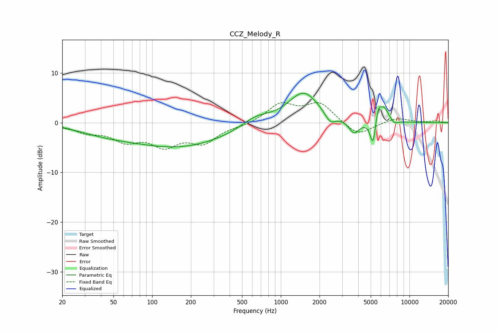

# CCZ_Melody_R
See [usage instructions](https://github.com/jaakkopasanen/AutoEq#usage) for more options and info.

### Parametric EQs
Apply preamp of -6.0 dB when using parametric equalizer.

|   # | Type    |   Fc (Hz) |    Q |   Gain (dB) |
|-----|---------|-----------|------|-------------|
|   1 | Peaking |        42 | 0.69 |        -1.2 |
|   2 | Peaking |       161 | 0.36 |        -4.8 |
|   3 | Peaking |       641 | 1.24 |         1.9 |
|   4 | Peaking |      1503 | 1.18 |         6.2 |
|   5 | Peaking |      2422 | 3.48 |        -2   |
|   6 | Peaking |      3715 | 3.49 |        -2.7 |
|   7 | Peaking |      5224 | 6    |        -6.1 |
|   8 | Peaking |      5680 | 4.97 |         3.8 |
|   9 | Peaking |      6386 | 3.85 |         2.5 |
|  10 | Peaking |      7660 | 4.88 |        -0.8 |

### Fixed Band EQs
When using fixed band (also called graphic) equalizer, apply preamp of **-4.1 dB** (if available) and set gains manually with these parameters.

|   # | Type    |   Fc (Hz) |    Q |   Gain (dB) |
|-----|---------|-----------|------|-------------|
|   1 | Peaking |        31 | 1.41 |        -1.7 |
|   2 | Peaking |        62 | 1.41 |        -3.2 |
|   3 | Peaking |       125 | 1.41 |        -4.1 |
|   4 | Peaking |       250 | 1.41 |        -3.6 |
|   5 | Peaking |       500 | 1.41 |        -0.6 |
|   6 | Peaking |      1000 | 1.41 |         3.6 |
|   7 | Peaking |      2000 | 1.41 |         3.8 |
|   8 | Peaking |      4000 | 1.41 |        -2.8 |
|   9 | Peaking |      8000 | 1.41 |         1   |
|  10 | Peaking |     16000 | 1.41 |         0.3 |

### Graphs

