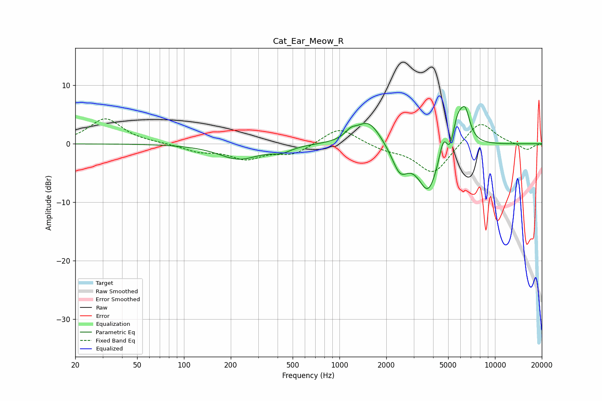

# Cat_Ear_Meow_R
See [usage instructions](https://github.com/jaakkopasanen/AutoEq#usage) for more options and info.

### Parametric EQs
Apply preamp of -6.5 dB when using parametric equalizer.

|   # | Type    |   Fc (Hz) |    Q |   Gain (dB) |
|-----|---------|-----------|------|-------------|
|   1 | Peaking |       226 | 1.09 |        -2.6 |
|   2 | Peaking |       422 | 2.28 |        -0.9 |
|   3 | Peaking |      1183 | 3.93 |         1.1 |
|   4 | Peaking |      1537 | 1.76 |         4.2 |
|   5 | Peaking |      2448 | 2.72 |        -4.3 |
|   6 | Peaking |      3728 | 2.07 |        -8.2 |
|   7 | Peaking |      4649 | 5.35 |         3.3 |
|   8 | Peaking |      5147 | 6    |        -2.4 |
|   9 | Peaking |      5787 | 3.19 |         5.5 |
|  10 | Peaking |      6469 | 4.67 |         4   |

### Fixed Band EQs
When using fixed band (also called graphic) equalizer, apply preamp of **-4.4 dB** (if available) and set gains manually with these parameters.

|   # | Type    |   Fc (Hz) |    Q |   Gain (dB) |
|-----|---------|-----------|------|-------------|
|   1 | Peaking |        31 | 1.41 |         4.3 |
|   2 | Peaking |        62 | 1.41 |         0.1 |
|   3 | Peaking |       125 | 1.41 |        -1.2 |
|   4 | Peaking |       250 | 1.41 |        -2.4 |
|   5 | Peaking |       500 | 1.41 |        -1.7 |
|   6 | Peaking |      1000 | 1.41 |         3   |
|   7 | Peaking |      2000 | 1.41 |        -0.9 |
|   8 | Peaking |      4000 | 1.41 |        -5.2 |
|   9 | Peaking |      8000 | 1.41 |         4.1 |
|  10 | Peaking |     16000 | 1.41 |        -1.1 |

### Graphs

