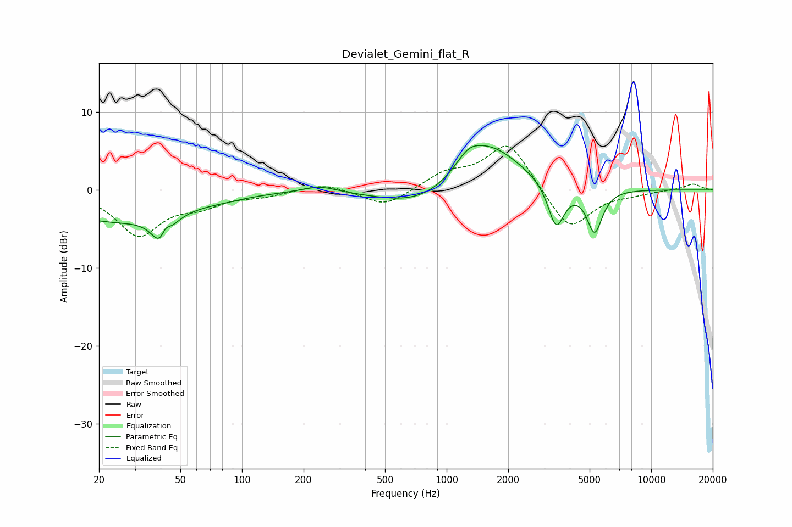

# Devialet_Gemini_flat_R
See [usage instructions](https://github.com/jaakkopasanen/AutoEq#usage) for more options and info.

### Parametric EQs
Apply preamp of -5.8 dB when using parametric equalizer.

|   # | Type    |   Fc (Hz) |    Q |   Gain (dB) |
|-----|---------|-----------|------|-------------|
|   1 | Peaking |        24 | 0.47 |        -3.9 |
|   2 | Peaking |        41 | 3.34 |        -5   |
|   3 | Peaking |        42 | 5.74 |         2.7 |
|   4 | Peaking |        80 | 1.31 |        -0.3 |
|   5 | Peaking |       240 | 1.66 |         0.9 |
|   6 | Peaking |       768 | 0.71 |        -2.7 |
|   7 | Peaking |      1275 | 2.32 |         1.9 |
|   8 | Peaking |      1606 | 0.88 |         6.1 |
|   9 | Peaking |      3431 | 3.51 |        -5.7 |
|  10 | Peaking |      5291 | 3.68 |        -5.6 |

### Fixed Band EQs
When using fixed band (also called graphic) equalizer, apply preamp of **-5.7 dB** (if available) and set gains manually with these parameters.

|   # | Type    |   Fc (Hz) |    Q |   Gain (dB) |
|-----|---------|-----------|------|-------------|
|   1 | Peaking |        31 | 1.41 |        -5.6 |
|   2 | Peaking |        62 | 1.41 |        -1.6 |
|   3 | Peaking |       125 | 1.41 |        -0.6 |
|   4 | Peaking |       250 | 1.41 |         0.9 |
|   5 | Peaking |       500 | 1.41 |        -2.2 |
|   6 | Peaking |      1000 | 1.41 |         2   |
|   7 | Peaking |      2000 | 1.41 |         6.3 |
|   8 | Peaking |      4000 | 1.41 |        -5.4 |
|   9 | Peaking |      8000 | 1.41 |        -0.4 |
|  10 | Peaking |     16000 | 1.41 |         0.8 |

### Graphs

