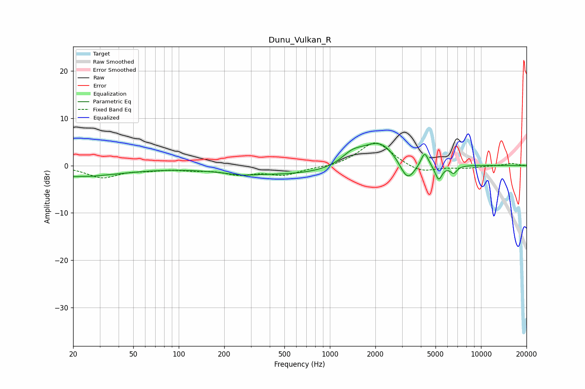

# Dunu_Vulkan_R
See [usage instructions](https://github.com/jaakkopasanen/AutoEq#usage) for more options and info.

### Parametric EQs
Apply preamp of -4.8 dB when using parametric equalizer.

|   # | Type    |   Fc (Hz) |    Q |   Gain (dB) |
|-----|---------|-----------|------|-------------|
|   1 | Peaking |        20 | 0.43 |        -2.3 |
|   2 | Peaking |        26 | 4.63 |        -0.1 |
|   3 | Peaking |       257 | 1.95 |        -0.4 |
|   4 | Peaking |       571 | 0.29 |        -2   |
|   5 | Peaking |      1402 | 1.95 |         2.2 |
|   6 | Peaking |      2128 | 1.15 |         5.6 |
|   7 | Peaking |      3253 | 2.75 |        -4.6 |
|   8 | Peaking |      4236 | 5.94 |         3.1 |
|   9 | Peaking |      5244 | 6    |        -3.2 |
|  10 | Peaking |      6585 | 6    |        -1.6 |

### Fixed Band EQs
When using fixed band (also called graphic) equalizer, apply preamp of **-4.9 dB** (if available) and set gains manually with these parameters.

|   # | Type    |   Fc (Hz) |    Q |   Gain (dB) |
|-----|---------|-----------|------|-------------|
|   1 | Peaking |        31 | 1.41 |        -2.4 |
|   2 | Peaking |        62 | 1.41 |        -0.7 |
|   3 | Peaking |       125 | 1.41 |        -0.7 |
|   4 | Peaking |       250 | 1.41 |        -1.6 |
|   5 | Peaking |       500 | 1.41 |        -1.8 |
|   6 | Peaking |      1000 | 1.41 |        -0.4 |
|   7 | Peaking |      2000 | 1.41 |         5.2 |
|   8 | Peaking |      4000 | 1.41 |        -1.7 |
|   9 | Peaking |      8000 | 1.41 |        -0.5 |
|  10 | Peaking |     16000 | 1.41 |         0.5 |

### Graphs

