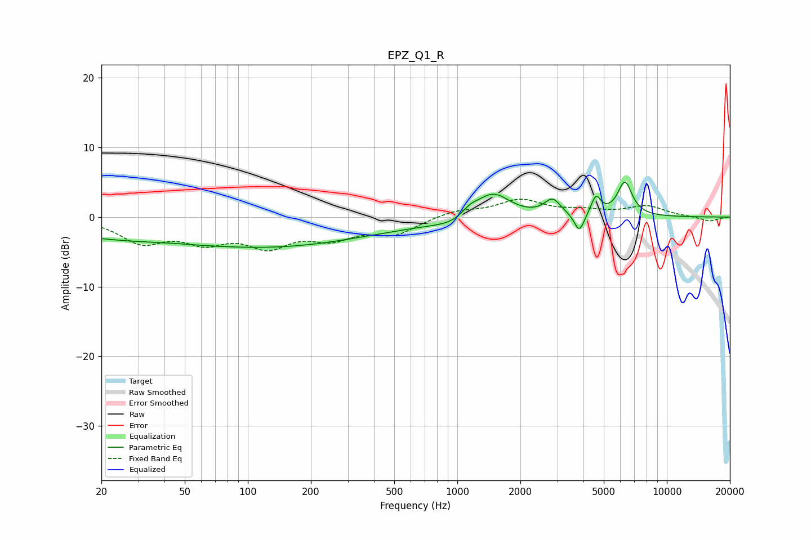

# EPZ_Q1_R
See [usage instructions](https://github.com/jaakkopasanen/AutoEq#usage) for more options and info.

### Parametric EQs
Apply preamp of -5.1 dB when using parametric equalizer.

|   # | Type    |   Fc (Hz) |    Q |   Gain (dB) |
|-----|---------|-----------|------|-------------|
|   1 | Peaking |        41 | 1.05 |         0.2 |
|   2 | Peaking |        53 | 0.2  |        -3.7 |
|   3 | Peaking |       277 | 0.34 |        -1.5 |
|   4 | Peaking |       974 | 1.56 |        -0.9 |
|   5 | Peaking |      1151 | 3.35 |         1.1 |
|   6 | Peaking |      1480 | 1.74 |         3.7 |
|   7 | Peaking |      2848 | 3.66 |         2.3 |
|   8 | Peaking |      3823 | 5.83 |        -2.8 |
|   9 | Peaking |      4587 | 6    |         2.6 |
|  10 | Peaking |      6305 | 3.96 |         4.9 |

### Fixed Band EQs
When using fixed band (also called graphic) equalizer, apply preamp of **-2.7 dB** (if available) and set gains manually with these parameters.

|   # | Type    |   Fc (Hz) |    Q |   Gain (dB) |
|-----|---------|-----------|------|-------------|
|   1 | Peaking |        31 | 1.41 |        -3.4 |
|   2 | Peaking |        62 | 1.41 |        -3   |
|   3 | Peaking |       125 | 1.41 |        -3.7 |
|   4 | Peaking |       250 | 1.41 |        -2.6 |
|   5 | Peaking |       500 | 1.41 |        -2.3 |
|   6 | Peaking |      1000 | 1.41 |         0.9 |
|   7 | Peaking |      2000 | 1.41 |         2.3 |
|   8 | Peaking |      4000 | 1.41 |         0.7 |
|   9 | Peaking |      8000 | 1.41 |         1.5 |
|  10 | Peaking |     16000 | 1.41 |        -0.6 |

### Graphs

