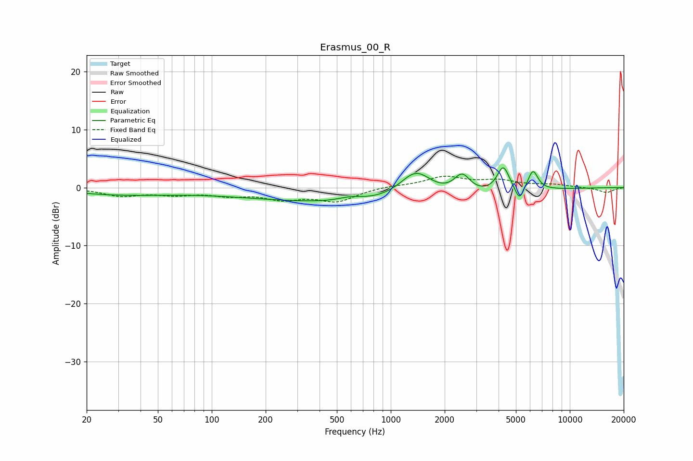

# Erasmus_00_R
See [usage instructions](https://github.com/jaakkopasanen/AutoEq#usage) for more options and info.

### Parametric EQs
Apply preamp of -3.5 dB when using parametric equalizer.

|   # | Type    |   Fc (Hz) |    Q |   Gain (dB) |
|-----|---------|-----------|------|-------------|
|   1 | Peaking |        29 | 0.58 |        -1.1 |
|   2 | Peaking |        56 | 1.11 |        -0.1 |
|   3 | Peaking |       153 | 0.43 |        -0.9 |
|   4 | Peaking |       594 | 2.04 |         0.7 |
|   5 | Peaking |      1002 | 0.24 |        -2.7 |
|   6 | Peaking |      1380 | 1.55 |         4.9 |
|   7 | Peaking |      2502 | 3.12 |         3.3 |
|   8 | Peaking |      4248 | 4.09 |         4.4 |
|   9 | Peaking |      5232 | 6    |        -2.4 |
|  10 | Peaking |      6223 | 4.92 |         3.4 |

### Fixed Band EQs
When using fixed band (also called graphic) equalizer, apply preamp of **-2.0 dB** (if available) and set gains manually with these parameters.

|   # | Type    |   Fc (Hz) |    Q |   Gain (dB) |
|-----|---------|-----------|------|-------------|
|   1 | Peaking |        31 | 1.41 |        -1.3 |
|   2 | Peaking |        62 | 1.41 |        -1   |
|   3 | Peaking |       125 | 1.41 |        -1.1 |
|   4 | Peaking |       250 | 1.41 |        -1.7 |
|   5 | Peaking |       500 | 1.41 |        -2.2 |
|   6 | Peaking |      1000 | 1.41 |         0.3 |
|   7 | Peaking |      2000 | 1.41 |         1.8 |
|   8 | Peaking |      4000 | 1.41 |         1.1 |
|   9 | Peaking |      8000 | 1.41 |         0.5 |
|  10 | Peaking |     16000 | 1.41 |        -0.9 |

### Graphs

