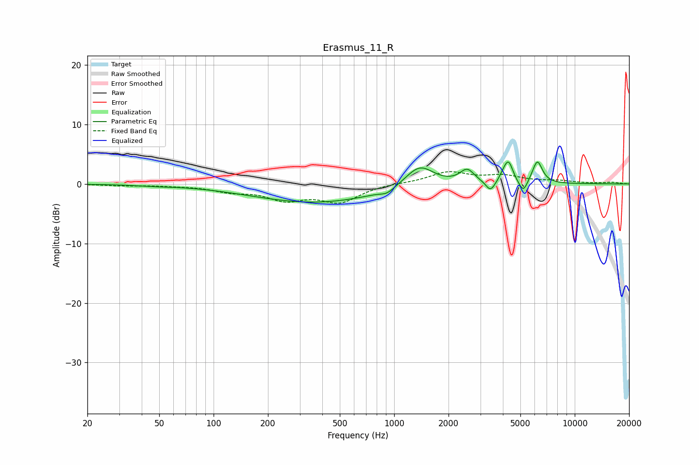

# Erasmus_11_R
See [usage instructions](https://github.com/jaakkopasanen/AutoEq#usage) for more options and info.

### Parametric EQs
Apply preamp of -3.8 dB when using parametric equalizer.

|   # | Type    |   Fc (Hz) |    Q |   Gain (dB) |
|-----|---------|-----------|------|-------------|
|   1 | Peaking |        47 | 1.43 |        -0.2 |
|   2 | Peaking |       370 | 0.39 |        -3.1 |
|   3 | Peaking |       914 | 3.86 |        -0.8 |
|   4 | Peaking |      1383 | 1.78 |         3.7 |
|   5 | Peaking |      2538 | 3.51 |         2.3 |
|   6 | Peaking |      3417 | 5.55 |        -1.8 |
|   7 | Peaking |      4042 | 6    |         1   |
|   8 | Peaking |      4304 | 5.86 |         3.3 |
|   9 | Peaking |      5185 | 6    |        -2.1 |
|  10 | Peaking |      6209 | 5.02 |         3.8 |

### Fixed Band EQs
When using fixed band (also called graphic) equalizer, apply preamp of **-2.2 dB** (if available) and set gains manually with these parameters.

|   # | Type    |   Fc (Hz) |    Q |   Gain (dB) |
|-----|---------|-----------|------|-------------|
|   1 | Peaking |        31 | 1.41 |        -0.2 |
|   2 | Peaking |        62 | 1.41 |        -0.2 |
|   3 | Peaking |       125 | 1.41 |        -1.1 |
|   4 | Peaking |       250 | 1.41 |        -2.4 |
|   5 | Peaking |       500 | 1.41 |        -2.9 |
|   6 | Peaking |      1000 | 1.41 |         0.1 |
|   7 | Peaking |      2000 | 1.41 |         1.9 |
|   8 | Peaking |      4000 | 1.41 |         1.2 |
|   9 | Peaking |      8000 | 1.41 |         0.4 |
|  10 | Peaking |     16000 | 1.41 |         0.2 |

### Graphs

