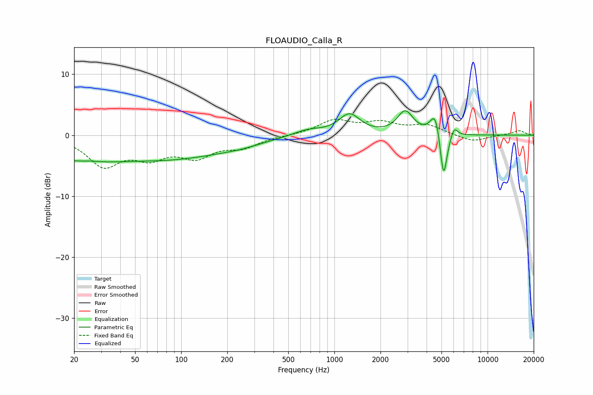

# FLOAUDIO_Calla_R
See [usage instructions](https://github.com/jaakkopasanen/AutoEq#usage) for more options and info.

### Parametric EQs
Apply preamp of -4.1 dB when using parametric equalizer.

|   # | Type    |   Fc (Hz) |    Q |   Gain (dB) |
|-----|---------|-----------|------|-------------|
|   1 | Peaking |        22 | 0.76 |        -3.6 |
|   2 | Peaking |        25 | 1.66 |         0.9 |
|   3 | Peaking |        84 | 0.35 |        -3.7 |
|   4 | Peaking |       244 | 1.2  |        -0.4 |
|   5 | Peaking |       668 | 1.4  |         1   |
|   6 | Peaking |      1255 | 2.04 |         3.3 |
|   7 | Peaking |      2901 | 2.74 |         3.7 |
|   8 | Peaking |      4570 | 4.32 |         4.2 |
|   9 | Peaking |      5156 | 5.9  |        -8.3 |
|  10 | Peaking |      6045 | 6    |         1.7 |

### Fixed Band EQs
When using fixed band (also called graphic) equalizer, apply preamp of **-2.7 dB** (if available) and set gains manually with these parameters.

|   # | Type    |   Fc (Hz) |    Q |   Gain (dB) |
|-----|---------|-----------|------|-------------|
|   1 | Peaking |        31 | 1.41 |        -4.7 |
|   2 | Peaking |        62 | 1.41 |        -3   |
|   3 | Peaking |       125 | 1.41 |        -3.1 |
|   4 | Peaking |       250 | 1.41 |        -1.7 |
|   5 | Peaking |       500 | 1.41 |        -0   |
|   6 | Peaking |      1000 | 1.41 |         2.3 |
|   7 | Peaking |      2000 | 1.41 |         1.8 |
|   8 | Peaking |      4000 | 1.41 |         1.5 |
|   9 | Peaking |      8000 | 1.41 |        -1.1 |
|  10 | Peaking |     16000 | 1.41 |         0.8 |

### Graphs

