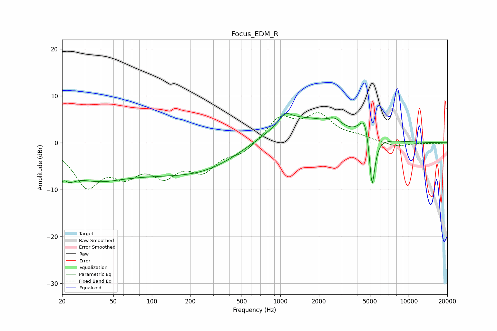

# Focus_EDM_R
See [usage instructions](https://github.com/jaakkopasanen/AutoEq#usage) for more options and info.

### Parametric EQs
Apply preamp of -6.3 dB when using parametric equalizer.

|   # | Type    |   Fc (Hz) |    Q |   Gain (dB) |
|-----|---------|-----------|------|-------------|
|   1 | Peaking |        20 | 2.59 |        -6.7 |
|   2 | Peaking |        21 | 4.86 |         3.6 |
|   3 | Peaking |        38 | 0.88 |        -2   |
|   4 | Peaking |        86 | 0.18 |        -6.5 |
|   5 | Peaking |       271 | 0.6  |        -1.4 |
|   6 | Peaking |      1093 | 2.84 |         2.2 |
|   7 | Peaking |      1417 | 0.52 |         5.6 |
|   8 | Peaking |      2640 | 2.71 |         1.6 |
|   9 | Peaking |      4577 | 3.4  |         5.5 |
|  10 | Peaking |      5190 | 6    |       -12.9 |

### Fixed Band EQs
When using fixed band (also called graphic) equalizer, apply preamp of **-6.5 dB** (if available) and set gains manually with these parameters.

|   # | Type    |   Fc (Hz) |    Q |   Gain (dB) |
|-----|---------|-----------|------|-------------|
|   1 | Peaking |        31 | 1.41 |        -8.6 |
|   2 | Peaking |        62 | 1.41 |        -5.3 |
|   3 | Peaking |       125 | 1.41 |        -5.7 |
|   4 | Peaking |       250 | 1.41 |        -5.2 |
|   5 | Peaking |       500 | 1.41 |        -2.1 |
|   6 | Peaking |      1000 | 1.41 |         5.2 |
|   7 | Peaking |      2000 | 1.41 |         5.4 |
|   8 | Peaking |      4000 | 1.41 |         1   |
|   9 | Peaking |      8000 | 1.41 |        -0.9 |
|  10 | Peaking |     16000 | 1.41 |        -0.2 |

### Graphs

