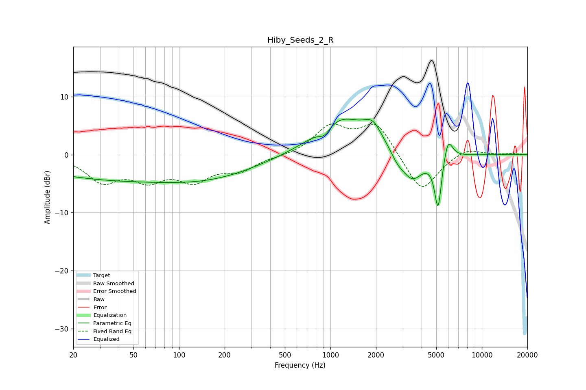

# Hiby_Seeds_2_R
See [usage instructions](https://github.com/jaakkopasanen/AutoEq#usage) for more options and info.

### Parametric EQs
Apply preamp of -6.2 dB when using parametric equalizer.

|   # | Type    |   Fc (Hz) |    Q |   Gain (dB) |
|-----|---------|-----------|------|-------------|
|   1 | Peaking |        36 | 2.13 |        -0   |
|   2 | Peaking |        42 | 0.23 |        -4.2 |
|   3 | Peaking |       198 | 0.48 |        -2   |
|   4 | Peaking |       914 | 3.71 |        -1.6 |
|   5 | Peaking |      1164 | 0.84 |         6.4 |
|   6 | Peaking |      1905 | 2.32 |         3.2 |
|   7 | Peaking |      2780 | 3.25 |        -1.4 |
|   8 | Peaking |      3470 | 1.96 |        -4.8 |
|   9 | Peaking |      5142 | 5.92 |        -9.3 |
|  10 | Peaking |      5971 | 4.52 |         4   |

### Fixed Band EQs
When using fixed band (also called graphic) equalizer, apply preamp of **-5.4 dB** (if available) and set gains manually with these parameters.

|   # | Type    |   Fc (Hz) |    Q |   Gain (dB) |
|-----|---------|-----------|------|-------------|
|   1 | Peaking |        31 | 1.41 |        -4.3 |
|   2 | Peaking |        62 | 1.41 |        -3.7 |
|   3 | Peaking |       125 | 1.41 |        -3.9 |
|   4 | Peaking |       250 | 1.41 |        -2.5 |
|   5 | Peaking |       500 | 1.41 |        -0.3 |
|   6 | Peaking |      1000 | 1.41 |         4.6 |
|   7 | Peaking |      2000 | 1.41 |         5.5 |
|   8 | Peaking |      4000 | 1.41 |        -6.8 |
|   9 | Peaking |      8000 | 1.41 |         1.3 |
|  10 | Peaking |     16000 | 1.41 |         0.2 |

### Graphs

