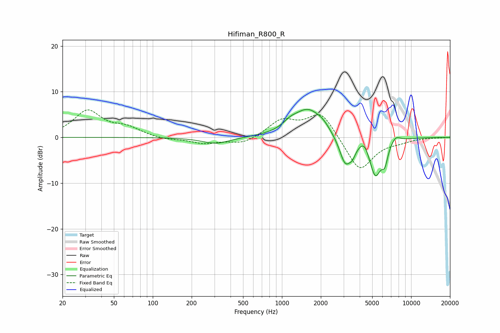

# Hifiman_R800_R
See [usage instructions](https://github.com/jaakkopasanen/AutoEq#usage) for more options and info.

### Parametric EQs
Apply preamp of -6.2 dB when using parametric equalizer.

|   # | Type    |   Fc (Hz) |    Q |   Gain (dB) |
|-----|---------|-----------|------|-------------|
|   1 | Peaking |       309 | 1.32 |        -1.4 |
|   2 | Peaking |      1158 | 2.58 |         1.2 |
|   3 | Peaking |      1586 | 1.26 |         6   |
|   4 | Peaking |      2074 | 2.73 |         1   |
|   5 | Peaking |      3092 | 3.02 |        -6.2 |
|   6 | Peaking |      3512 | 5.7  |        -1.7 |
|   7 | Peaking |      4357 | 3.82 |         2.2 |
|   8 | Peaking |      5280 | 2.8  |        -8.4 |
|   9 | Peaking |      6258 | 6    |        -3.3 |
|  10 | Peaking |      7576 | 3.76 |         1.4 |

### Fixed Band EQs
When using fixed band (also called graphic) equalizer, apply preamp of **-6.1 dB** (if available) and set gains manually with these parameters.

|   # | Type    |   Fc (Hz) |    Q |   Gain (dB) |
|-----|---------|-----------|------|-------------|
|   1 | Peaking |        31 | 1.41 |         5.7 |
|   2 | Peaking |        62 | 1.41 |         1.9 |
|   3 | Peaking |       125 | 1.41 |        -0.5 |
|   4 | Peaking |       250 | 1.41 |        -1.3 |
|   5 | Peaking |       500 | 1.41 |        -1.5 |
|   6 | Peaking |      1000 | 1.41 |         3.6 |
|   7 | Peaking |      2000 | 1.41 |         5.7 |
|   8 | Peaking |      4000 | 1.41 |        -7.6 |
|   9 | Peaking |      8000 | 1.41 |        -0.7 |
|  10 | Peaking |     16000 | 1.41 |        -0.1 |

### Graphs

