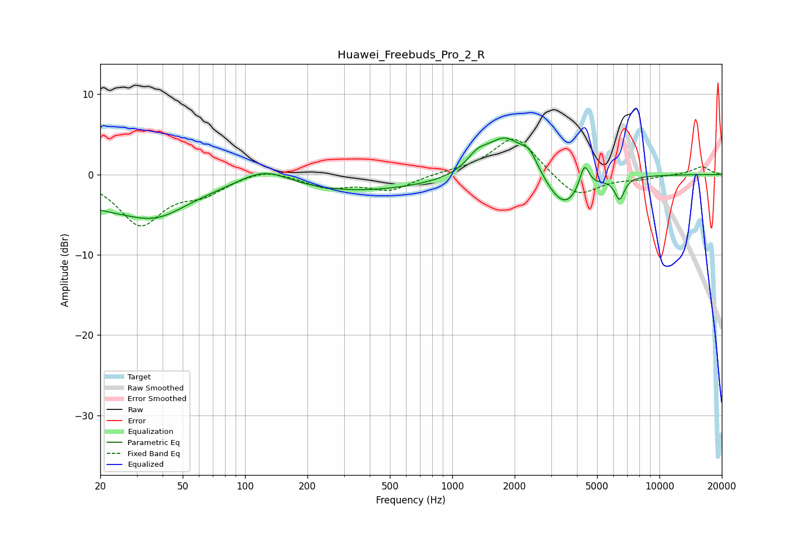

# Huawei_Freebuds_Pro_2_R
See [usage instructions](https://github.com/jaakkopasanen/AutoEq#usage) for more options and info.

### Parametric EQs
Apply preamp of -4.6 dB when using parametric equalizer.

|   # | Type    |   Fc (Hz) |    Q |   Gain (dB) |
|-----|---------|-----------|------|-------------|
|   1 | Peaking |        24 | 0.4  |        -3.9 |
|   2 | Peaking |        38 | 1.08 |        -2   |
|   3 | Peaking |       124 | 1.1  |         2.4 |
|   4 | Peaking |       324 | 0.34 |        -2.1 |
|   5 | Peaking |      1320 | 2.84 |         1.6 |
|   6 | Peaking |      1802 | 1.49 |         4.9 |
|   7 | Peaking |      2362 | 3.61 |         1.9 |
|   8 | Peaking |      3468 | 1.64 |        -4.5 |
|   9 | Peaking |      4343 | 5.99 |         3.2 |
|  10 | Peaking |      6420 | 6    |        -2.7 |

### Fixed Band EQs
When using fixed band (also called graphic) equalizer, apply preamp of **-4.5 dB** (if available) and set gains manually with these parameters.

|   # | Type    |   Fc (Hz) |    Q |   Gain (dB) |
|-----|---------|-----------|------|-------------|
|   1 | Peaking |        31 | 1.41 |        -6.1 |
|   2 | Peaking |        62 | 1.41 |        -2   |
|   3 | Peaking |       125 | 1.41 |         1   |
|   4 | Peaking |       250 | 1.41 |        -1.5 |
|   5 | Peaking |       500 | 1.41 |        -1.9 |
|   6 | Peaking |      1000 | 1.41 |         0.3 |
|   7 | Peaking |      2000 | 1.41 |         4.9 |
|   8 | Peaking |      4000 | 1.41 |        -3   |
|   9 | Peaking |      8000 | 1.41 |        -0.4 |
|  10 | Peaking |     16000 | 1.41 |         1   |

### Graphs

