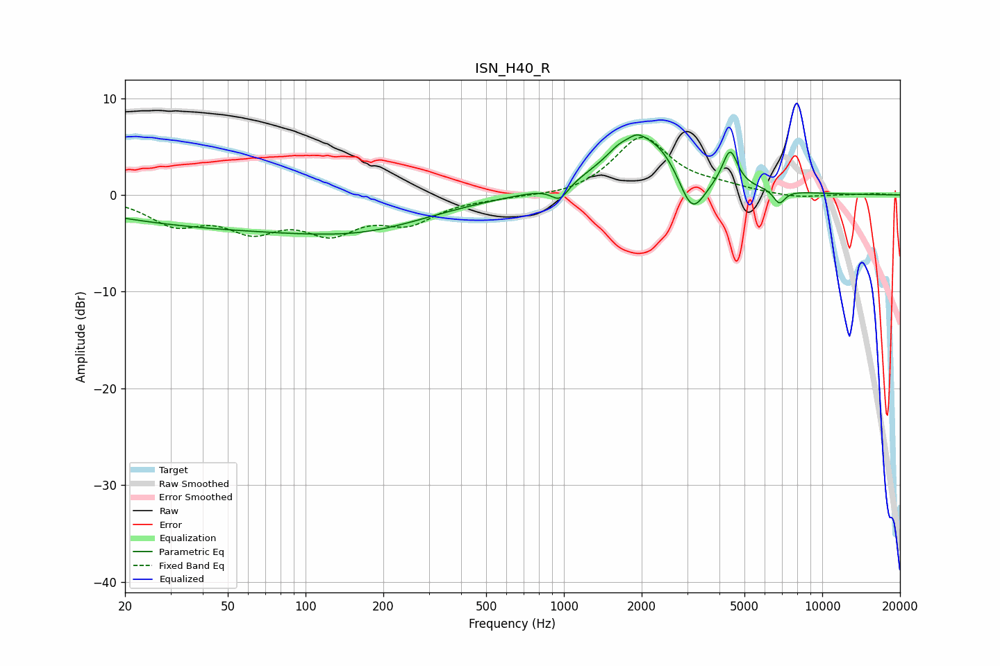

# ISN_H40_R
See [usage instructions](https://github.com/jaakkopasanen/AutoEq#usage) for more options and info.

### Parametric EQs
Apply preamp of -6.3 dB when using parametric equalizer.

|   # | Type    |   Fc (Hz) |    Q |   Gain (dB) |
|-----|---------|-----------|------|-------------|
|   1 | Peaking |        52 | 0.26 |        -3.2 |
|   2 | Peaking |       183 | 0.55 |        -1.9 |
|   3 | Peaking |       965 | 4.12 |        -1.6 |
|   4 | Peaking |      1627 | 3.14 |         0.8 |
|   5 | Peaking |      1919 | 4.89 |         0.6 |
|   6 | Peaking |      2146 | 0.94 |         6.2 |
|   7 | Peaking |      3128 | 2.63 |        -5.1 |
|   8 | Peaking |      4377 | 4.81 |         3   |
|   9 | Peaking |      4464 | 5.87 |         0.7 |
|  10 | Peaking |      6821 | 6    |        -1.4 |

### Fixed Band EQs
When using fixed band (also called graphic) equalizer, apply preamp of **-6.0 dB** (if available) and set gains manually with these parameters.

|   # | Type    |   Fc (Hz) |    Q |   Gain (dB) |
|-----|---------|-----------|------|-------------|
|   1 | Peaking |        31 | 1.41 |        -2.7 |
|   2 | Peaking |        62 | 1.41 |        -3.1 |
|   3 | Peaking |       125 | 1.41 |        -3.3 |
|   4 | Peaking |       250 | 1.41 |        -2.5 |
|   5 | Peaking |       500 | 1.41 |        -0.2 |
|   6 | Peaking |      1000 | 1.41 |        -0.3 |
|   7 | Peaking |      2000 | 1.41 |         5.9 |
|   8 | Peaking |      4000 | 1.41 |         0.6 |
|   9 | Peaking |      8000 | 1.41 |        -0.4 |
|  10 | Peaking |     16000 | 1.41 |         0.1 |

### Graphs

