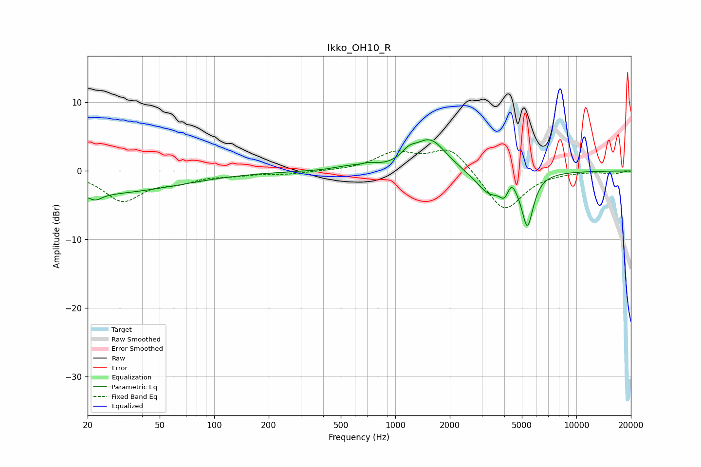

# Ikko_OH10_R
See [usage instructions](https://github.com/jaakkopasanen/AutoEq#usage) for more options and info.

### Parametric EQs
Apply preamp of -4.6 dB when using parametric equalizer.

|   # | Type    |   Fc (Hz) |    Q |   Gain (dB) |
|-----|---------|-----------|------|-------------|
|   1 | Peaking |        21 | 0.29 |        -3.3 |
|   2 | Peaking |        22 | 4.1  |        -0.9 |
|   3 | Peaking |       544 | 1.91 |         0.5 |
|   4 | Peaking |       716 | 3.31 |         0.5 |
|   5 | Peaking |      1187 | 3.64 |         1.2 |
|   6 | Peaking |      1559 | 1.6  |         4.6 |
|   7 | Peaking |      3328 | 1.84 |        -3.4 |
|   8 | Peaking |      4001 | 6    |        -1.6 |
|   9 | Peaking |      4386 | 5.98 |         1.3 |
|  10 | Peaking |      5364 | 4.26 |        -7.5 |

### Fixed Band EQs
When using fixed band (also called graphic) equalizer, apply preamp of **-3.1 dB** (if available) and set gains manually with these parameters.

|   # | Type    |   Fc (Hz) |    Q |   Gain (dB) |
|-----|---------|-----------|------|-------------|
|   1 | Peaking |        31 | 1.41 |        -4.2 |
|   2 | Peaking |        62 | 1.41 |        -1.3 |
|   3 | Peaking |       125 | 1.41 |        -0.5 |
|   4 | Peaking |       250 | 1.41 |        -0.4 |
|   5 | Peaking |       500 | 1.41 |        -0   |
|   6 | Peaking |      1000 | 1.41 |         2.5 |
|   7 | Peaking |      2000 | 1.41 |         3.6 |
|   8 | Peaking |      4000 | 1.41 |        -6   |
|   9 | Peaking |      8000 | 1.41 |        -0.1 |
|  10 | Peaking |     16000 | 1.41 |        -0.4 |

### Graphs

