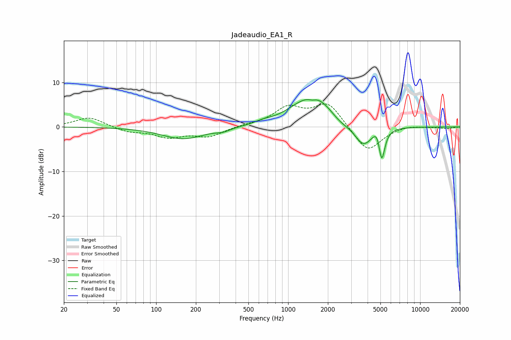

# Jadeaudio_EA1_R
See [usage instructions](https://github.com/jaakkopasanen/AutoEq#usage) for more options and info.

### Parametric EQs
Apply preamp of -6.2 dB when using parametric equalizer.

|   # | Type    |   Fc (Hz) |    Q |   Gain (dB) |
|-----|---------|-----------|------|-------------|
|   1 | Peaking |       160 | 0.88 |        -2.7 |
|   2 | Peaking |       320 | 2.9  |        -0.6 |
|   3 | Peaking |       650 | 2.02 |         0.6 |
|   4 | Peaking |      1188 | 1.18 |         1.8 |
|   5 | Peaking |      1520 | 5.05 |        -0.6 |
|   6 | Peaking |      1626 | 1.07 |         5.9 |
|   7 | Peaking |      2474 | 2.14 |        -1.1 |
|   8 | Peaking |      3710 | 2.09 |        -4.7 |
|   9 | Peaking |      4735 | 4.79 |         2.3 |
|  10 | Peaking |      5116 | 5.94 |        -7.4 |

### Fixed Band EQs
When using fixed band (also called graphic) equalizer, apply preamp of **-5.3 dB** (if available) and set gains manually with these parameters.

|   # | Type    |   Fc (Hz) |    Q |   Gain (dB) |
|-----|---------|-----------|------|-------------|
|   1 | Peaking |        31 | 1.41 |         2.2 |
|   2 | Peaking |        62 | 1.41 |        -1.1 |
|   3 | Peaking |       125 | 1.41 |        -2.1 |
|   4 | Peaking |       250 | 1.41 |        -2.1 |
|   5 | Peaking |       500 | 1.41 |         0.4 |
|   6 | Peaking |      1000 | 1.41 |         4.1 |
|   7 | Peaking |      2000 | 1.41 |         5.4 |
|   8 | Peaking |      4000 | 1.41 |        -5.8 |
|   9 | Peaking |      8000 | 1.41 |         0.5 |
|  10 | Peaking |     16000 | 1.41 |        -0.3 |

### Graphs

