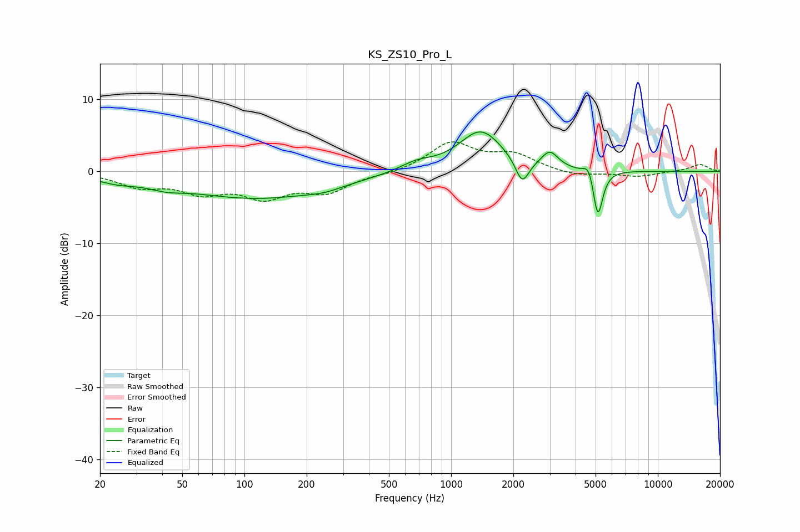

# KS_ZS10_Pro_L
See [usage instructions](https://github.com/jaakkopasanen/AutoEq#usage) for more options and info.

### Parametric EQs
Apply preamp of -5.6 dB when using parametric equalizer.

|   # | Type    |   Fc (Hz) |    Q |   Gain (dB) |
|-----|---------|-----------|------|-------------|
|   1 | Peaking |        24 | 1.43 |        -0.9 |
|   2 | Peaking |        42 | 1.74 |        -0.7 |
|   3 | Peaking |       115 | 0.4  |        -3.7 |
|   4 | Peaking |       244 | 1.64 |        -0.6 |
|   5 | Peaking |       678 | 1.73 |         1.1 |
|   6 | Peaking |      1392 | 1.33 |         5.6 |
|   7 | Peaking |      2207 | 4.33 |        -3.5 |
|   8 | Peaking |      3002 | 3.56 |         2.2 |
|   9 | Peaking |      4636 | 5.99 |         1.8 |
|  10 | Peaking |      5130 | 6    |        -6.7 |

### Fixed Band EQs
When using fixed band (also called graphic) equalizer, apply preamp of **-4.2 dB** (if available) and set gains manually with these parameters.

|   # | Type    |   Fc (Hz) |    Q |   Gain (dB) |
|-----|---------|-----------|------|-------------|
|   1 | Peaking |        31 | 1.41 |        -1.9 |
|   2 | Peaking |        62 | 1.41 |        -2.5 |
|   3 | Peaking |       125 | 1.41 |        -3.2 |
|   4 | Peaking |       250 | 1.41 |        -2.6 |
|   5 | Peaking |       500 | 1.41 |        -0.3 |
|   6 | Peaking |      1000 | 1.41 |         3.9 |
|   7 | Peaking |      2000 | 1.41 |         2.1 |
|   8 | Peaking |      4000 | 1.41 |        -0.7 |
|   9 | Peaking |      8000 | 1.41 |        -0.7 |
|  10 | Peaking |     16000 | 1.41 |         1   |

### Graphs

